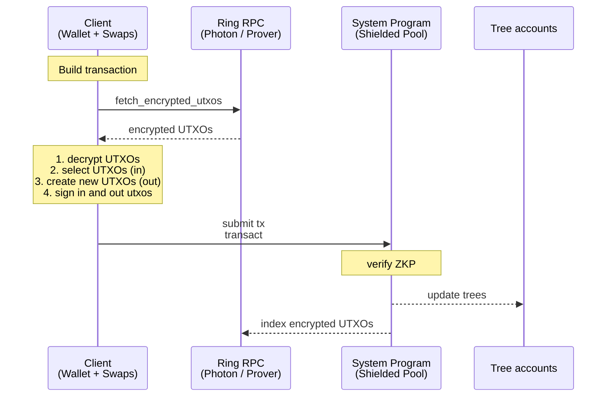
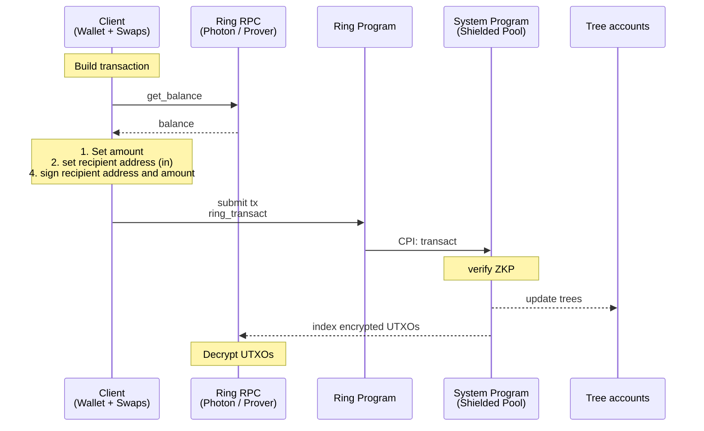
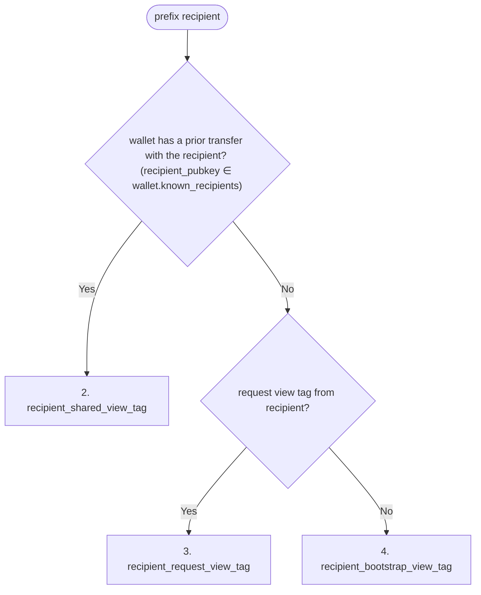
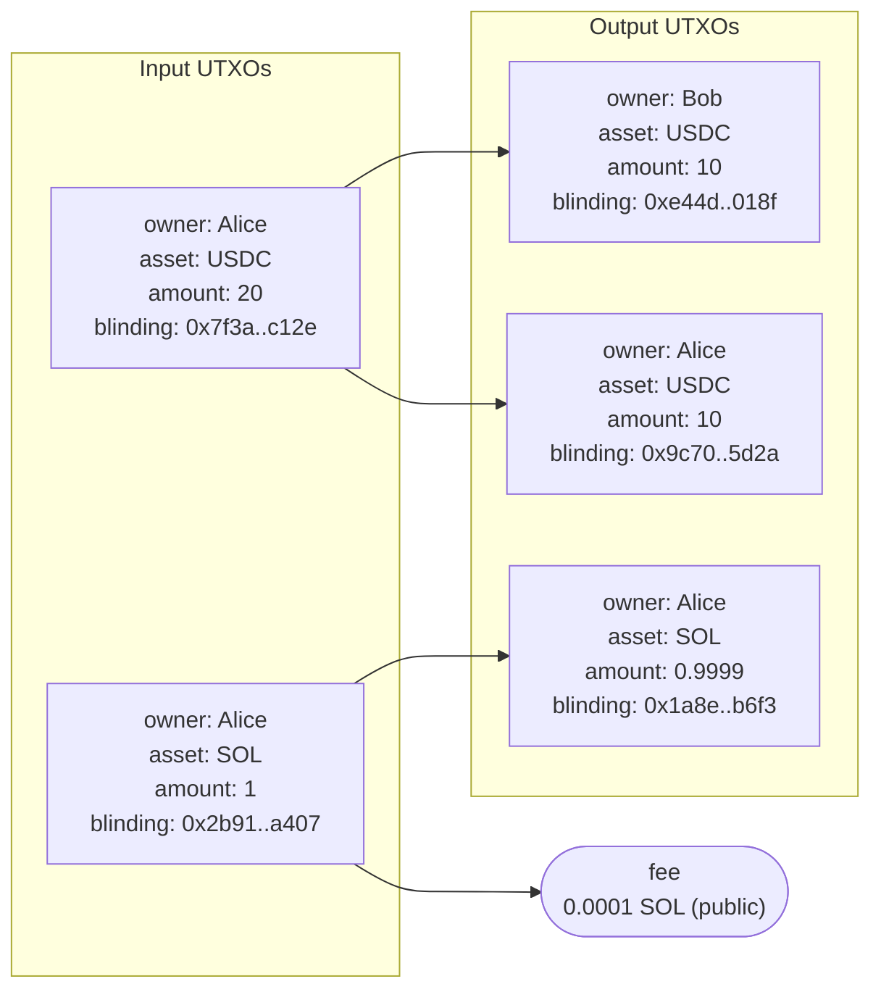
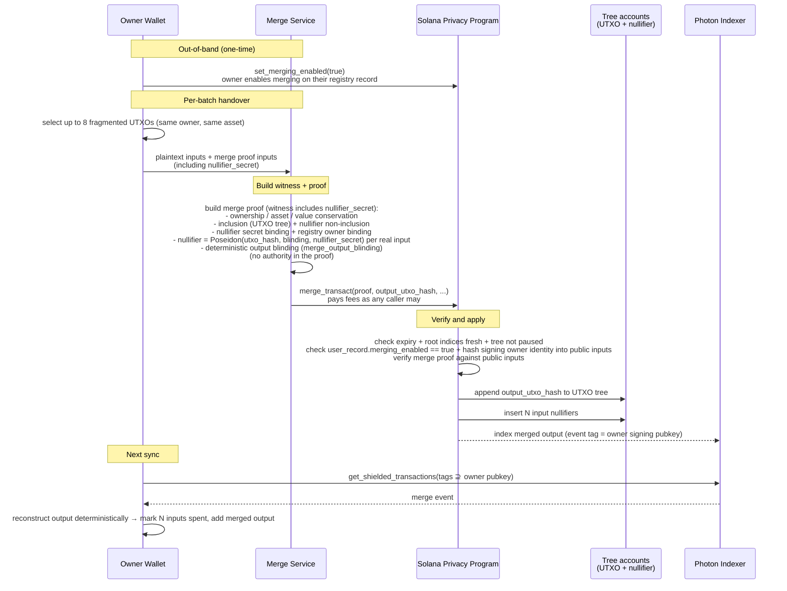

# Spec

## Table of Contents

- [Abstract](#abstract)
- [Architecture](#architecture)
  - [Operations](#operations)
    - [User](#user)
    - [Protocol](#protocol)
    - [Ring Creator](#ring-creator)
    - [Merge Service](#merge-service)
  - [Concurrency & Balance Fragmentation](#concurrency--balance-fragmentation)
  - [Default Ring](#default-ring)
  - [Policy Rings](#policy-rings)
- [Glossary](#glossary)
- [Shielded Address](#shielded-address)
- [Shielded Keypair](#shielded-keypair)
  - [Signing Key](#signing-key)
  - [Nullifier Key](#nullifier-key)
  - [ViewingKey](#viewingkey)
    - [Derived secrets](#derived-secrets)
    - [Transaction Viewing Key](#transaction-viewing-key)
    - [View Tags](#view-tags)
      - [Sender View Tag](#sender-view-tag)
      - [Recipient view tag](#recipient-view-tag)
      - [Merge view tag](#merge-view-tag)
      - [View Tag Selection](#view-tag-selection)
    - [Methods](#methods)
  - [Derivation seed](#derivation-seed)
  - [Solana wallet](#solana-wallet)
  - [Local P-256](#local-p-256)
  - [HSM](#hsm)
  - [Seed phrase](#seed-phrase)
  - [PDA](#pda)
- [UTXO](#utxo)
  - [UTXO Hash](#utxo-hash)
  - [Nullifier](#nullifier)
  - [Blinding Seed](#blinding-seed)
  - [Output Blinding](#output-blinding)
- [Output UTXO Serialization](#output-utxo-serialization)
  - [UTXO Data](#utxo-data)
  - [Transfer](#transfer-2)
    - [Plaintext Layout](#plaintext-layout)
    - [Instruction Data Layout](#instruction-data-layout)
  - [Plaintext Transfer](#plaintext-transfer)
  - [UTXO Split](#utxo-split)
    - [Plaintext Layout](#plaintext-layout-1)
    - [Instruction Data Layout](#instruction-data-layout-1)
  - [Merge](#merge)
    - [Plaintext Layout](#plaintext-layout-2)
    - [Instruction Data Layout](#instruction-data-layout-2)
- [SPP Proof - Solana Privacy ZK Proof](#spp-proof---solana-privacy-zk-proof)
- [Merge Proof - Merge ZK Proof](#merge-proof---merge-zk-proof)
- [SPP - Solana Privacy Program](#spp---solana-privacy-program)
  - [Accounts](#accounts)
    - [Authority Governance](#authority-governance)
    - [Ring Accounts](#ring-accounts)
  - [Instructions](#instructions)
    - [transact](#transact)
    - [deposit](#deposit)
    - [ring_deposit](#ring_deposit)
    - [merge_transact](#merge_transact)
    - [merge_ring](#merge_ring)
- [Ring Program Interface](#ring-program-interface)
- [ZK Program Interface](#zk-program-interface)
- [RPC](#rpc)
  - [Indexer](#indexer)
    - [getEncryptedUtxosByTags](#getencryptedutxosbytags)
    - [getShieldedTransactionsByTags](#getshieldedtransactionsbytags)
    - [subscribeToShieldedTransactionsByTags](#subscribetoshieldedtransactionsbytags)
    - [getMerkleProofs](#getmerkleproofs)
    - [getNonInclusionProofs](#getnoninclusionproofs)
  - [Prover](#prover)
  - [Relayer](#relayer)
  - [Ring RPC](#ring-rpc)
    - [get_decrypted_utxos_by_owner](#get_decrypted_utxos_by_owner)
    - [get_decrypted_transactions_by_owner](#get_decrypted_transactions_by_owner)
    - [subscribe_to_decrypted_transactions_by_owner](#subscribe_to_decrypted_transactions_by_owner)
  - [Merge Service](#merge-service-1)
  - [Registry](#registry)
    - [Record](#record)
    - [Operations](#operations-1)
      - [`get_record`](#get_record)
      - [`register`](#register)
      - [`set_merging_enabled`](#set_merging_enabled)
- [User Flows](#user-flows)
  - [First Time Sync Wallet](#first-time-sync-wallet)
  - [Merge Flow](#merge-flow)
  - [Transfer User Flows](#transfer-user-flows)
    - [Privacy Guarantee Matrix](#privacy-guarantee-matrix)

## Abstract

The solana privacy protocol (TSPP) enables programmable, UTXO-based confidential transfers that execute directly on Solana, and supports private DeFi and institutional compliance. UTXO balances are backed by SPL and Token-2022 tokens, viewing keys provide selective disclosure, and owner tagging enables wallet sync at Solana speed. Policy rings add anonymity.

Confidential transfers are performed by a minimal Solana Privacy Program (SPP) that enforces UTXO state transitions with a zero knowledge proof (ZKP). To enable private DeFi, third-party programs run custom private logic in a separate ZKP over user-owned UTXOs that hold arbitrary `utxo_data`, authorized by the owner's signature. For tailored compliance, institutions can implement rings with custom ring programs, for example with configurable auditors, authorities, freeze authority, co-signer, permanent delegate, and anonymity.

For wallet sync at Solana RPC speed, the owner pubkey prefixes every encrypted UTXO so wallets and indexers locate relevant outputs without trial decryption.

For compatibility with Solana addresses, a registry maps Solana addresses to shielded addresses, so a sender holding only a recipient's Solana address can pay them privately.

An optional merge service consolidates fragmented balances without per-merge wallet signatures once the owner enables merging on their registry record.

The document specifies the key derivation, UTXO layout, SPP accounts and instructions, the ring program interface, the ZK program interface, the ZK circuits, the indexer / prover / relayer / ring RPC / merge service / registry interfaces, and user flows.

# Architecture


Source: [`diagrams/architecture.dot`](diagrams/architecture.dot). Regenerate with `just render-diagrams`.

1. Users — own wallets, build encrypted transactions, and authorize spends with Ed25519 transaction signatures.
2. Photon Indexer — indexes trees + encrypted UTXOs; default-ring users fetch ciphertexts here.
3. Ring RPC (with auditor) — RPC with auditor keys; decrypts and serves UTXOs to policy-ring users.
4. Prover — generates Groth16 proofs. Users can generate client side proofs as well.
5. Relayer (optional) — fee-payer that submits a transaction on a user's behalf; by default users invoke the programs directly. Targets SPP (default ring), the ZK Swap program, or a Ring program (policy ring).
6. Forester — processes the nullifier queue into the nullifier tree and closes reclaimable nullifier PDAs.
7. SPP (Solana Privacy Program) — verifies proofs, updates trees, moves SPL to and from the vaults.
8. ZK Swap Program — enforces swap logic in a zk proof and settles the swap with a shielded transfer by CPI into a Ring program or directly into SPP.
9. Ring Programs (1..N) — config programs; verify policy proofs and CPI into SPP.
10. SPL interface — per-mint SPL / Token-22 holding all shielded tokens.
11. Tree accounts — co-located UTXO tree, nullifier tree, and nullifier queue.

Per-flow sequence diagrams are in the [User Flows](#user-flows) section below.


## Operations

### User

Operations 1-4 run against the default ring via [`transact`](#transact) (or [`deposit`](#deposit)), or against a policy ring via the ring program's CPI into `ring_transact` (or [`ring_deposit`](#ring_deposit) for proofless deposits).

| # | Name | Description | Privacy |
| --- | --- | --- | --- |
| 1 | deposit | Deposit SPL tokens into the shielded pool; existing UTXOs can be merged in the same transaction. | sender + amount visible; recipient visible |
| 2 | deposit | Public deposit without a proof. Allows depositing dynamic amounts, for example for the flow withdraw, swap, deposit. | sender + amount visible; recipient `owner` visible |
| 3 | withdraw | Withdraw SPL tokens from the shielded pool to a public account. | sender visible (or hidden via an optional relayer); recipient + amount visible |
| 4 | shielded transfer | Transfer value between shielded balances. | confidential: amount hidden; sender + recipient visible (anonymous in a policy ring) |

### Protocol

| # | Name | Description |
| --- | --- | --- |
| 1 | create_spl_interface | Initialize SPL/Token-22 pool escrow per token mint |
| 2 | create_tree | Create and initialize a new Tree PDA (nullifier tree + queue and UTXO tree, co-located) |
| 3 | create_protocol_config | Initialize protocol config (role authorities, permissionless flags) |
| 4 | update_protocol_config | Rotate the protocol config authority and the role authorities |
| 5 | pause_tree | Freeze writes to a Tree account |
| 6 | set_tree_fees | Set a tree's fee schedule (insertion fee, append and close reimbursements) |
| 7 | claim_tree_lamports | Claim a tree's lamports above its rent, fee balance, and nullifier PDA working capital |
| 8 | set_ring_activation | Activate or deactivate a ring, and set its `ring_authority_transact_is_enabled` |

### Ring Creator

Operations performed by the owner of a policy ring's config.

| # | Name | Description |
| --- | --- | --- |
| 1 | create_ring_config | Create the ring config PDA and set its owner; activation follows [Ring Accounts](#ring-accounts) |
| 2 | update_ring_config | Set `paused`. A paused ring cannot authorize any ring operation; the owner can still update or rotate the config |
| 3 | update_ring_config_owner | Transfer ring config ownership |
| 4 | ring_authority_transact | Prove correctness of a state transition by a ring authority (freeze, thaw, permanent-delegate transfer) |

### Merge Service

Operations performed by a merge service for a user who has enabled merging (`merging_enabled = true`) on their [registry record](#registry). See [Merge Service](#merge-service-1) for the operator's responsibilities.

| # | Name | Description |
| --- | --- | --- |
| 1 | merge_transact | Consolidate N input UTXOs of the same owner and asset into one default-ring output UTXO |
| 2 | merge_ring | Policy-ring analog of `merge_transact`; called via CPI from a ring program. Inputs and output share `ring_program_id` |


## Concurrency & Balance Fragmentation

UTXOs are inherently concurrent. Every transaction to a user will fragment the users balance since the transaction amount is a new UTXO.

1. The balance of a keypair can be used concurrently when it is split up between a number of utxos.
2. To keep the balance spendable in one transaction we split it in up to X utxos.
3. Optionally, fragmented balances can be reconsolidated without user interaction by a trust minimized [merge service](#merge_transact) once the user has enabled merging on their registry record.


## Default Ring

The default ring is confidential and has no policy: amounts and assets are private, owners are public. Each output is tagged by its Ed25519 owner pubkey and bound to the output UTXO in the SPP proof, so wallets sync by querying the indexer for their own pubkey.
Users invoke the SPP directly.
An optional merge service can be used to improve UX.

### Transfer



## Policy Rings

**Properties:**
1. Fully programmable: the ring creator deploys a ring program that implements custom logic enforcing encryption to auditors, authorities, freeze authority, co-signer, and permanent delegate.
2. Enter Ring: a ring is entered by a deposit from an SPL token account, the standard shielded pool, or another ring via a shielded transfer.
3. Exit Ring: a ring is exited by a withdraw to an SPL token account, the standard shielded pool, or another ring via a shielded transfer.
4. Transfers: users invoke the ring program, which CPIs into the SPP program.

**Policy sources:** the reference ring program compiles its rule table into the binary and pins `RuleTable.hash` over a per-list source map at `create_policy`. Each list the table references names the namespace serving it, the ring's own namespace PDA or a curator ring's. One curated list (an OFAC blocklist) serves many rings from one write. The map enters the policy hash as eight positional `(list_id, owner_hash)` slots and the transfer circuit resolves every answer's owner from it. `set_policy_source` lets the ring authority re-point one list only while the stored hash is reproducible from the deployed table, a rebuilt table stays fail closed. Every source claims its entry addresses in the ring's address tree, and the entries live in any tree. The encoding is pinned by `custom-rings/policy` and the cross-language vectors in `custom-rings/sdk/tests/go_policy_vectors.rs`.


### Transfer




# Glossary

Type aliases used in the `struct` definitions throughout this spec. Each is defined once here and referenced by name elsewhere.

| Type | Definition | Description |
| --- | --- | --- |
| `PublicKey` | `[u8; 34]` | 1-byte scheme prefix + 33-byte body. Prefix `0x00`: P256, SEC1-compressed point; `0x01`: Ed25519, 32-byte key then one zero byte; `0x02`: PDA, 32-byte Solana address then one zero byte (off-curve, cannot sign). The protocol's scheme-tagged key, used wherever the scheme varies — UTXO owners (`signing_pk` / `owner_pubkey`). |
| `P256Pubkey` | `[u8; 33]` | P256 public key, SEC1-compressed. No scheme prefix; used where the key is P256 by construction — viewing / ECDH keys (`tx_viewing_pk`, registry `viewing_pk`). |
| `P256Keypair` | — | A P256 `(secret, public)` keypair; its public half is a `P256Pubkey`. |
| `Signature` | `[u8; 64]` | A Solana (Ed25519) transaction signature. |
| `ECDSASignature` | `[u8; 64]` | A P256 ECDSA signature (`r‖s`); authenticates an RPC request under the signer's key. |
| `SPPProof` | `[u8; 192]` | Vanilla Groth16 proof `a(32) || b(128) || c(32)`: `a` and `c` are compressed G1 points, `b` is the raw big-endian G2 point. |
| `TransactProof` | struct | A 192-byte vanilla Groth16 proof (`a`, `b`, `c`): `a` and `c` compressed G1 (32 bytes each), `b` the raw big-endian G2 point (128 bytes). |
| `CircuitId` | enum | Selects the circuit family and fixed shape: `ConfidentialEddsa`, `RingEddsa`, `RingP256`, or `RingAuthority`, each carrying `(n_inputs, n_outputs, n_public_asset_slots)`. Owner-signed families have `*Cached` twins that add `CacheAccess { input_bitmap: u64, write_bitmap: u64 }` and use the family's key. Unknown values are rejected at deserialization. |

Raw fixed-size byte arrays keep their literal types where no alias adds clarity:

- `[u8; 32]` — a Poseidon or SHA-256 digest, a BN254 field element (including blindings), an owner pubkey, or a view tag.

Hashing conventions:

- `Sha256BE` — SHA-256 over the byte preimage, then `digest[0] = 0`, interpreted as a BN254 field element. Zeroing the most-significant byte holds the result below the BN254 field modulus.
- `hash_bytes_N` — a fixed-length byte commitment. Split the `N` bytes into consecutive 31-byte big-endian chunks, right-align each chunk in a 32-byte BN254 field representation, set `acc = chunk_0`, then fold each remaining chunk as `acc = Poseidon(acc, chunk_i)`. `hash_bytes_0([]) = 0`; a value of at most 31 bytes is its packed field value and invokes no Poseidon permutation. The length is fixed by the calling protocol type and is not encoded or domain-separated. A generic variable-length byte-hash API is forbidden.

# Shielded Address

A shielded address consists of the signing public key, signs to spend UTXOs, the nullifier public key, ties the nullifier to a spent UTXO, and the viewing public key, encrypts the UTXO.
In compressed form the signing and nullifier public keys are compressed in an owner poseidon hash.

`ShieldedAddress = (signing_pk, nullifier_pk, viewing_pk)`

`CompressedShieldedAddress = (owner_hash, viewing_pk)`

## Fixed-byte proof-input encoding

Raw fixed-size values use `hash_bytes_N` everywhere they enter a field-level
commitment. Structured hashes over values that are already field elements keep
their stated Poseidon preimages.

```
Solana owner (Ed25519 pubkey or PDA address, 32 B):
  owner_proof_input_hash(pk) := hash_bytes_33(0x53 || pk)      // 'S'

P256 owner (33 B SEC1):
  owner_proof_input_hash(pk) := hash_bytes_33(0x50 || pk.x)    // 'P'

P256 viewing key (33 B SEC1, retained for viewing/ECDH):
  viewing_proof_input_hash(pk) := hash_bytes_33(pk)

Ring program id (32 B, untagged; `0` when absent):
  pk_field(program_id) := hash_bytes_32(program_id)
```

Owner identities are algorithm-tagged so a P256 x-coordinate and a Solana key
with the same bytes have distinct identities. The tags avoid the SEC1 prefixes
`0x02`, `0x03`, and `0x04`, so an owner identity cannot equal a viewing-key
commitment. The `RingP256` proof computes the P256 identity; SPP hashes Solana
identities.

## Owner Hash

```
owner_hash := Poseidon(owner_proof_input_hash(signing_pk), nullifier_pk)
```

SPP derives the Solana owner proof input from the verified signer account — an
Ed25519 signer or a PDA signing via `invoke_signed`. The circuit relies on the
SVM's signature verification, so the two are equivalent in the proof. The
`RingP256` rail instead proves one shared P256 signature and derives the owner
proof input from the point's x-coordinate in-circuit.

# Shielded Keypair

The client-side triple behind a [Shielded Address](#shielded-address): a
[Signing Key](#signing-key), a [Nullifier Key](#nullifier-key), and a
[ViewingKey](#viewingkey).

**Curves** (the `PublicKey` scheme prefix, [Glossary](#glossary)):

- `Ed25519` — Solana signer, authorized by SPP's signer-account check.
- `P256` — `RingP256` rail, one shared P256 signature proven in-circuit.
- `Pda` — off the Ed25519 curve and cannot sign; the owning program authorizes via `invoke_signed`.

**Interface**:

- `signing_pubkey` — the [Signing Key](#signing-key) public key (`PublicKey`).
- `viewing_pubkey` — [ViewingKey](#viewingkey) public key (`P256Pubkey`).
- `curve` — the signing scheme identifier: the `PublicKey` scheme prefix ([Glossary](#glossary)).
- `sign_message(msg)` — message signature in the scheme's native form ([Signing Key](#signing-key) methods).
- `sign_hash(hash)` — signature over a caller-supplied digest, for the proof path ([Signing Key](#signing-key) methods).
- `nullifier_key` — the host-side [Nullifier Key](#nullifier-key), used to build spendable inputs.
- `nullifier(utxo)` — the UTXO's [nullifier](#nullifier).
- `nullifier_pk` — the published half of the nullifier role ([Nullifier Key](#nullifier-key)).
- `owner_hash` — the [Owner Hash](#owner-hash) of the signing and nullifier public keys.
- `shielded_address` — the three public keys as a [Shielded Address](#shielded-address).
- `compressed_address` — its compressed form: `owner_hash` and `viewing_pubkey`.

## Signing Key

`(signing_sk, signing_pk)` — the spend-authorizing keypair.

**Methods:**

- `pubkey() -> PublicKey` — the scheme-tagged public key ([Glossary](#glossary)).
- `sign_message(msg) -> Result<Signature>` — the scheme's native message signature: Ed25519 over the raw bytes (RFC 8032, delegated to the host Solana wallet), P256 as ECDSA over `SHA-256(msg)` normalized to low-S, matching Solana's secp256r1 precompile. PDA: error.
- `sign_hash(hash: [u8; 32]) -> Result<Signature>` — P256 ECDSA over a caller-supplied digest; the proof verifies it against `SHA-256(private_tx_hash || external_data_hash)`. Ed25519 owners sign digest bytes with `sign_message`; PDA: error.

## Nullifier Key

Symmetric 31-byte key to derive nullifiers. The `nullifier_secret` is
wallet-side material: it is a private proof input on every spend path, so it
cannot be hardware-resident. It is required to spend but does not authorize a
spend: authorization is the owner signature, checked by the proof
(`RingP256`) or by SPP's signer-account check (Ed25519, PDA).

`nullifier_pk := Poseidon(nullifier_secret)`

**Methods:**

- `nullifier_pk() -> [u8; 32]` — returns `nullifier_pk` (defined above).
- `nullifier(utxo) -> [u8; 32]` — the UTXO's [nullifier](#nullifier).

## ViewingKey

`(viewing_sk, viewing_pk)` — P-256 keypair, used for HPKE encryption and to
derive view-tag secrets. Viewing keys can rotate. Each scenario defines how
`viewing_sk` is produced.

### Derived secrets

Secrets derive from `view_root`, an ECDH-derived root, so the viewing key can stay in an HSM (one `CKM_ECDH1_DERIVE`).

- `P_const   := hash_to_curve_P256(DST="TSPP/view_root/P_const/v1")` — RFC 9380 `P256_XMD:SHA-256_SSWU_RO_`; fixed generator, unknown discrete log relative to `G` (else `ECDH(viewing_sk, P_const) = p·viewing_pk` would be public).
- `view_root := HKDF-Extract(salt=∅, IKM=ECDH(viewing_sk, P_const))` — `ECDH` is the shared point's 32-byte big-endian x-coordinate.
- `sender_view_tag_secret    := HKDF-Expand(view_root, "TSPP/sender_view_tag",    L=32)`
- `recipient_view_tag_secret := HKDF-Expand(view_root, "TSPP/recipient_view_tag", L=32)`
- `tx_viewing_secret         := HKDF-Expand(view_root, "TSPP/tx_viewing",         L=32)` — seeds the transaction viewing keys.

### Transaction Viewing Key

The transaction viewing key is a single use keypair (ephemeral key) that is deterministically derived for every private transaction.
Every ciphertext in a transaction is encrypted with HPKE between the transaction viewing key and the ciphertext owner's viewing key.
This way the transaction viewing key can decrypt both the sender's change and recipient UTXOs of the transaction.

**Properties**

- **Scope**: one transaction.
- **Read-only**: viewing keys grant decryption only.
- **Derivable on demand**:
  ```
  first_nullifier := nullifier_key.nullifier(inputs[0])              // see [Nullifier](#nullifier)
  (tx_viewing_sk, tx_viewing_pk) := HKDF-SHA256(salt=first_nullifier, IKM=tx_viewing_secret, info="TSPP/tx_viewing")
  ```
  `tx_viewing_secret` is defined in [Derived secrets](#derived-secrets). Binding the HKDF salt to `first_nullifier` makes the keypair unique per Solana transaction (nullifier tree uniqueness implies `tx_viewing_pk` uniqueness).

### View Tags

The view-tag types in this section (`sender_view_tag`, `recipient_shared_view_tag`, `recipient_request_view_tag`, `recipient_bootstrap_view_tag`) apply to **anonymous policy rings only**. In the confidential [default ring](#default-ring) every output — sender change, recipients, and the [`merge_transact`](#merge_transact) output — is tagged by its Ed25519 owner pubkey, so a wallet syncs by querying the indexer for its own owner pubkey.

Policy rings hide the recipient, so a wallet cannot find its outputs by owner pubkey as in the [default ring](#default-ring). Instead a view tag, a 32-byte value attached to a ciphertext, lets wallets sync by querying the indexer for exact view-tag matches and decrypt only their own transactions. Derivation splits into two cases — tags the sender derives for themselves to discover their own change UTXOs, and tags the sender derives for the recipient to discover incoming transfers.

A recipients wallet cannot pre-derive shared tags for every possible sender. Therefore the wallet needs to know which senders to derive view tags for. The first transfer between a new sender-recipient pair uses a tag the recipient can find without prior knowledge of the sender: either `recipient_request_view_tag` (recipient minted, shared out-of-band) or `recipient_bootstrap_view_tag = recipient.viewing_pk` (no coordination required). This first transfer establishes the pair: on decryption the recipient reads `sender_pubkey` from the ciphertext and derives the shared ECDH key, and subsequent transfers from this sender use a shared tag (`recipient_shared_view_tag`) to find transaction. `sender → recipient` and `recipient → sender` produce disjoint tags.

**Uniqueness.** View tags should not be reused. The indexer must handle the case that these may be used multiple times erroneously and return all ciphertexts matching a single tag value.

**Encoding.**  all view tags are constant length 32 bytes. Shorter view tags are prefixed with 0s.

#### Sender View Tag

1. **`sender_view_tag`**
  - Derived by: the sender, to index her change utxos.
  - Tx sent by: the sender
  - Indexed by: the sender
  - Derivation: `HKDF-SHA256(salt=∅, IKM=sender_view_tag_secret, info="TSPP/sender_view_tag/" || u64_be(tx_count), L=31)`.

#### Recipient view tag

2. **`recipient_shared_view_tag`**
    - Derived by: the sender and recipient independently. Sender via `get_send_shared_view_tag` to send the tx, the recipient via `get_recipient_shared_view_tag` to index the tx.
    - Tx sent by: the sender.
    - Indexed by: the recipient.
    - Derivation: two chained HKDFs over the ECDH shared secret.

      ```
      shared := ECDH(self.viewing_sk, counterparty_pubkey)
      domain := HKDF-SHA256(salt = ∅, IKM = shared,
                           info = "TSPP/pair-domain/" || R_pubkey, L = 32)
      return    HKDF-SHA256(salt = ∅, IKM = domain,
                           info = "TSPP/pair-hint/"   || u64_be(i), L = 31)
      ```

      `R_pubkey` is the recipient of the direction: `counterparty_pubkey` on the sender side (`get_send_shared_view_tag`), `self.viewing_pk` on the recipient side (`get_recipient_shared_view_tag`). ECDH symmetry plus the matched direction label produces the same byte value across the pair.
3. **`recipient_request_view_tag`**
    - Derived by: the recipient. The recipient shares the tag with the sender out-of-band as a `PaymentRequest`.
    - Tx sent by: the sender.
    - Indexed by: the recipient. Once the recipient decrypts this transfer, subsequent transfers from the same sender can be indexed by `recipient_shared_view_tag`.
    - Derivation: `HKDF-SHA256(salt=∅, IKM=recipient_view_tag_secret, info="TSPP/recipient_request_view_tag/" || u64_be(request_count), L=31)`.
4. **`recipient_bootstrap_view_tag`**
    - Derived by: anyone — `recipient.viewing_pk` 32-byte X-coordinate of the SEC1-compressed encoding (the 33-byte form with its 1-byte sign prefix dropped).
    - Tx sent by: the sender.
    - Indexed by: the recipient. Once the recipient decrypts this transfer, subsequent transfers from the same sender can be indexed by `recipient_shared_view_tag`.
    - [Plaintext Transfer](#plaintext-transfer): sender bundles and recipient slots are indexed by the 32-byte owner tag in place of `viewing_pk`. The slot contains no `sender_pubkey`, so `known_senders` / `known_recipients` are not updated and the next encrypted transfer between the pair is again a first transfer.


#### Merge output indexing (removed merge view tag)

The single-use `merge_view_tag` stream — `merge_view_tag_secret`, a per-user `merge_count`, the HKDF tag derivation, and SPP's nullifier-tree insertion of the tag — was removed. `merge_transact` tags the merged output with the owner signing pubkey like every confidential default-ring output; [`merge_ring`](#merge_ring) indexes the output by the **first input's published nullifier**; neither instruction takes a supplied tag. The output blinding and the padding-slot nullifiers are derived deterministically from the owner's nullifier secret and that first nullifier (`merge_output_blinding` / `merge_dummy_nullifier`, domain-separated Poseidon — see [Methods](#methods)), and replay protection comes from the proof-bound input nullifiers themselves.

#### View Tag Selection

In the [default ring](#default-ring) every output is tagged by its recipient owner pubkey, so the selection below applies only to anonymous policy rings. `merge_transact` outputs are tagged by the owner signing pubkey like every other default-ring output; `merge_ring` outputs are indexed by the first input's published nullifier, not by a view tag. Wallets select recipient tags as follows:



### Methods

1. `decrypt(ciphertext, tx_viewing_pk) -> Result<Plaintext>` — AES-CTR decryption with key `KDF(ECDH(viewing_sk, tx_viewing_pk))`.
2. `get_sender_view_tag(tx_count)` — policy-ring anonymous transfers only; tags the sender's own change UTXOs. The default ring tags change by the sender's owner pubkey.
3. `get_recipient_request_view_tag(request_count)` — used by the recipient to create a view tag for a `PaymentRequest` shared with the sender out-of-band.
4. `get_send_shared_view_tag(counterparty_pubkey, i)` — sender-side `recipient_shared_view_tag`; used for transfers to a recipient the sender has already paired with.
5. `get_recipient_shared_view_tag(counterparty_pubkey, i)` — recipient-side `recipient_shared_view_tag`; used during sync to scan transfers from each known sender.
6. `merge_output_blinding(first_nullifier)` / `merge_dummy_nullifier(first_nullifier, slot_index)` — deterministic merge derivations from the owner's nullifier secret (domain-separated Poseidon); used by the merge prover when building [`merge_transact`](#merge_transact) / [`merge_ring`](#merge_ring) and by the owner during sync to reconstruct merged outputs. Replaces the removed `get_merge_view_tag(merge_count)`.
7. `get_transaction_viewing_key(first_nullifier: [u8; 32]) -> P256Keypair` — per-transaction P-256 keypair for ECDH encryption to recipients.

## Derivation seed

The root secret both role keys expand from in the local-key scenarios
([Solana wallet](#solana-wallet), [Local P-256](#local-p-256)). Obtaining it
consumes only a signing operation (`ECDH` or a deterministic signature).

Role expansion, shared by both scenarios:

- `prk := HKDF-Extract(salt=∅, IKM=derivation_seed)`
- `nullifier_secret := HKDF-Expand(prk, nf_info, L=31)`
- `viewing_sk := HKDF-Expand(prk, view_info, L=48)` reduced to a P-256 scalar (RFC 9380 hash-to-field)

The two scenarios define `derivation_seed`, `nf_info`, and `view_info`.

**Derivation-input guard.** Signing rejects any message whose payload (bare or
off-chain encoded) starts with `"TSPP/derive/"`; generic ECDH rejects the
committed derivation points (`P_derive`, `P_pda` — see [PDA](#pda)).

## Solana wallet

Sign: the wallet's Ed25519 key, checked by SPP as the signer account.

- `derivation_seed := Ed25519_sign(signing_sk, derivation_message)` — deterministic (RFC 8032), so any wallet that signs off-chain messages reconstructs the keypair and the Ed25519 secret never leaves the wallet. The 64-byte seed is itself secret material: whoever holds it derives both role keys.
- `derivation_message` — the Solana off-chain message v0 encoding of the payload `"TSPP/derive/v1"`: `"\xffsolana offchain" || version=0 || application_domain || format=0 || signer_count=1 || signing_pk || u16_le(payload_len) || payload`, with `application_domain := SHA-256("TSPP/derive/v1")`.
- `nf_info = "TSPP/nf_key/ed25519/v1"`, `view_info = "TSPP/view_key/ed25519/v1"`.

## P-256 wallet

Sign: ECDSA with a locally held key (`RingP256` rail).

- `derivation_seed := ECDH(signing_sk, P_derive)` — the shared point's 32-byte big-endian x-coordinate (one `CKM_ECDH1_DERIVE`).
- `P_derive := hash_to_curve_P256(DST="TSPP/nullifier/P_nullifier/v1")` — same RFC 9380 construction as [`P_const`](#derived-secrets), distinct point; unknown discrete log, so only the signing-key holder can compute the shared x-coordinate.
- `nf_info = "TSPP/nf_key/ecdh/v1"`, `view_info = "TSPP/view_key/ecdh/v1"`.

## HSM

Sign: on the device. Device signing keys cannot run key agreement, so the
[derivation seed](#derivation-seed) is unavailable: the nullifier and viewing
roles root in separate device keys (three-key custody) and are supplied at
construction. The `nullifier_secret` stays host-side
([Nullifier Key](#nullifier-key)).

## Seed phrase

All three parts derive from one BIP-39 mnemonic: the signing key on Solana's
derivation path, the role keys on TSPP paths. Every path segment is hardened;
`node(path)` is the 32-byte SLIP-0010 Ed25519 node key at `path` (HMAC-SHA512
tree over the seed), `node_p256(path)` the 32-byte SLIP-0010 nist256p1 node
key (master key from HMAC-SHA512 with key `"Nist256p1 seed"`; invalid
candidates are handled inside SLIP-0010's derivation). `TSPP_COIN =
1392955331` (`be_u32(SHA-256("luminous.TSPP.v1")[0..4]) & 0x7FFF_FFFF`).

- `seed := BIP-39(mnemonic, passphrase)` — PBKDF2-HMAC-SHA512, 64 bytes; `passphrase = ""` unless the wallet sets one.
- `signing_sk := node(m/44'/501'/account'/0')` — Ed25519 secret on Solana's path: importing the mnemonic into a Solana wallet yields the same key.
- `p256_signing_sk := node_p256(m/44'/TSPP_COIN'/account'/0'/0')` — a valid P-256 scalar by construction.
- `nullifier_secret := node(m/44'/TSPP_COIN'/account'/1'/0')[1..32]` — the node key with its first byte dropped (31 bytes).
- `viewing_sk := node_p256(m/44'/TSPP_COIN'/account'/2'/0')` — a valid P-256 scalar by construction.
- Both identities use the same `nullifier_secret` and `viewing_sk`. Wherever both publish the shared `viewing_pk` — registry records, bootstrap view tags, shielded addresses — the two owners are linkable.
- `account'` — each account index is an independent shielded keypair.

Shares the signing key with the [Solana wallet](#solana-wallet) scenario but
not the role keys; the two keypairs coexist, and a seed-phrase wallet also
derives the Solana-wallet keypair to sync both.

## PDA

No signing key: the owning program authorizes with `invoke_signed`. Both role
keys expand from one viewing-key ECDH shared secret, with the PDA address in
each info tag so a holder does not reuse one identity across PDAs.

- `shared := ECDH(holder_viewing_sk, counterparty_viewing_pk)` — either participant derives the identity from its own viewing key and the counterparty's viewing pubkey. A sole holder uses `ECDH(holder_viewing_sk, P_pda)` with `P_pda := hash_to_curve_P256(DST="TSPP/pda_root/P_pda/v1")`.
- `prk := HKDF-Extract(salt=∅, IKM=shared)`
- `nullifier_secret := HKDF-Expand(prk, "TSPP/pda_nf/v1" || pda, L=31)`
- `viewing_sk := HKDF-Expand(prk, "TSPP/pda_view/v1" || pda, L=48)` reduced to a P-256 scalar (RFC 9380 hash-to-field)

# UTXO

A UTXO (unspent transaction output) represents an amount of an asset in the shielded pool that its owner can spend.
UTXO hashes are appended to the UTXO Merkle tree at creation and nullifiers are inserted into the Nullifier tree when a UTXO is spent to prevent double spending. A nullifier can only be inserted once into the nullifier tree.

Example: Alice transfers 10 USDC to Bob. Alice's starting balance is one 20 USDC UTXO and one 1 SOL UTXO. Fee is 0.0001 SOL.



```rust
struct Utxo {
    /// `UtxoDomain = 3`; padding and address slots use the domains in
    /// [Input slots](#input-slots).
    domain: u16,
    /// The recipient's `owner_hash` from their
    /// [Shielded Address](#shielded-address). Senders write this 32-byte value
    /// directly.
    owner: [u8; 32],
    /// Asset mint. SOL is Address::default().
    asset: Address,
    /// Amount in the smallest unit of `asset`.
    amount: u64,
    /// Field element ensuring distinct UTXO hashes for equal
    /// `(owner, asset, amount)` triples. `deposit` derives it from the leaf
    /// index (see [Blinding](#blinding-derivation)); a `transact` output takes
    /// the value in [Output Blinding](#output-blinding).
    blinding: [u8; 32],
    /// Arbitrary data committed via `data_hash`; the application circuit/SDK
    /// interprets it.
    utxo_data: Option<Vec<u8>>,
    /// Arbitrary ring data.
    ring_data: Option<Vec<u8>>,
    /// The ring program that authorizes spends of this UTXO.
    ring_program_id: Option<Address>,
}
```

## UTXO Hash

```
utxo_hash = Poseidon(domain, tree_id, asset, amount,
                     data_hash, ring_hash, owner_utxo_hash)

ring_hash       = Poseidon(ring_data_hash, pk_field(ring_program_id))
owner_utxo_hash = Poseidon(owner, blinding)
```

The SPP proof commits to `utxo_hash` for every input and output. `tree_id` is the raw `u16` id of the tree account that holds the UTXO: the tree an input is spent from, `output_tree` for an output. Equal UTXOs in different trees therefore have distinct hashes, nullifiers, and addresses. `owner` is the `owner_hash` from [Shielded Address](#shielded-address). `asset` is `hash_bytes_32(mint)`, with SOL as `hash_bytes_32(Address::default())`; `ring_program_id` uses `pk_field` (see [Shielded Address](#shielded-address)). An absent `ring_program_id` is `0` (not `pk_field(0)`), so a UTXO without one keeps `ring_hash` over a `0` program field. `data_hash` enters `utxo_hash` directly and is `0` when absent.

`owner` is a user `owner_hash`; there is no program ownership. A UTXO may hold `utxo_data`: `data_hash` is committed into `utxo_hash` unchecked, and the application circuit/SDK interprets it. `ring_hash` pairs `ring_data_hash` with the authorizing ring program, and a non-zero `ring_data_hash` requires a non-zero `ring_program_id`. `owner_utxo_hash` nests `owner` and `blinding`: it keeps the owner private on the `transact` rails, where the components stay in the proof and ciphertext. A `deposit` instead sends `owner` in the clear, and the program derives the `blinding` and recomputes `owner_utxo_hash`, so that rail does not hide the recipient.

## Nullifier

A nullifier deterministically derives from a UTXO and the recipient's [NullifierKey](#nullifierkey). Insertion into the nullifier tree must succeed only once.

```
nullifier    := Poseidon(utxo_hash, utxo_blinding, nullifier_secret)
```

nullifier_secret - must be committed in the owner hash, which enters `utxo_hash` via `owner_utxo_hash`.
utxo_blinding - must be committed as the `blinding` in `owner_utxo_hash`.

## Blinding Seed

Clients sample a private random field element, `blinding_seed`, for each `transact`
proof. The circuit derives the following values using the transaction's
`first_nullifier`, the published nullifier of input slot 0:

```
output_blinding_seed = Poseidon("TXOS", first_nullifier, blinding_seed)
blinding_i           = Poseidon("TXOB", first_nullifier, output_blinding_seed, i)
private_tx_blinding  = Poseidon("TXPB", first_nullifier, blinding_seed)
```

Each four-letter tag is its ASCII bytes read as a big-endian 32-bit integer.
Domain separation allows `output_blinding_seed` to be disclosed without revealing
`private_tx_blinding`. The circuit enforces the derivations, not the entropy or
secrecy of `blinding_seed`.

## Output Blinding

Every `transact` output, including padding dummies, uses `blinding_i` from
[Blinding Seed](#blinding-seed), with `i` its zero-based output slot index.

Hashing `first_nullifier` and `i` into the derivation keeps output commitments
distinct across accepted transactions and slots even if a client reuses
`blinding_seed`.

The [recipient](#recipient) plaintext contains the derived blinding. The
[sender](#sender), [plaintext transfer](#plaintext-transfer), and
[split](#utxo-split) bundles serialize the derived `output_blinding_seed` as
`blinding_seed`; readers derive each slot from it and `first_nullifier`.

Other rails have their own rules: [`deposit`](#blinding-derivation) derives the
blinding from the tree and leaf index; [`ring_deposit`](#ring_deposit) delegates
freshness to the ring; [merge](#merge) derives `merge_output_blinding` from the
owner's nullifier secret.

## Empty UTXO

Fixed-size circuits pad unused output slots with empty UTXOs. The domain is
`DummyDomain = 1`; every body field is zero except the derived
[blinding](#output-blinding):

```
owner = asset = amount = 0
utxo_data = ring_data = ring_program_id = None
```

`owner = 0` leaves the output permanently unspendable: spending it later requires
keys whose `owner_hash` is 0, which no one holds. An empty UTXO still
takes its slot's derived `blinding`, so it has a distinct `utxo_hash` and looks
like a real output, and an owner who knows the seed can reconstruct it. The sender
ciphertext also stays fixed-size (amounts are fixed-width), so neither the output
hash nor the ciphertext reveals whether the sender kept change.

The `private_tx_hash` output chain skips dummy outputs; their hashes still
enter the public `output_utxo_hashes` chain.

The confidential default ring reveals recipients but dummy utxos also carry cipher texts so that these are indistinguishable from real outputs.

`split` pads with owner-bound zero-value outputs, not empty UTXOs.

# Output UTXO Serialization

Output UTXO serialization is the per-output ciphertext layout for shielded
transactions. Each output's ciphertext lives in its own
[`TransactOutput.data`](#transact) slot; SPP does not parse `data`. Serialization is
a default-ring convention; policy rings can define their own.
UTXOs are encrypted with ECDH AES-256-CTR, except in the Plaintext Transfer scheme.
The shared `tx_viewing_pk` and `salt` are transaction-level fields of the
[transact](#transact) instruction, not part of any per-output payload. Each output
is tagged by its owner pubkey (the `owner_tag` value).

Schemes:

1. Transfer — one sender and `0<=` recipient ciphertexts.
2. UTXO Split — one ciphertext for M equal-amount outputs under the same owner.
3. Merge — no ciphertext (removed): the merged output is derived deterministically from the owner's nullifier secret and the first input nullifier, so there is nothing to encrypt (see [Merge output indexing](#merge-output-indexing-removed-merge-view-tag)).
4. Plaintext Transfer — the Transfer layout with unencrypted payloads.

## AES Key derivation

AES-CTR reuses a `(key, nonce)` pair if the same viewing key is derived twice (e.g. a failed transaction rebuilt with the same first nullifier). The `salt` prevents this. Key and nonce both derive from the single-use transaction viewing key, a per-transaction 16-byte CSPRNG `salt`, and the slot index.

Per ciphertext slot `i` — the ciphertext ordinal: the number of `data = Some` outputs
preceding this one (`0` = sender bundle, `1 + j` = recipient `j` in the Transfer
layout); `messages` continue the numbering after the last output ordinal:

```
ikm        = ECDH_x(tx_viewing_sk, recipient_viewing_pk) || tx_viewing_pk || recipient_viewing_pk
okm        = HKDF-SHA256(salt = ∅, IKM = ikm,
                         info = "TSPP/hpke/" || "TSPP/tx" || salt || u32_be(i), L = 44)
key        = okm[0..32]
nonce      = okm[32..44]                                    // 12 B, the AES-CTR nonce
ciphertext = AES-256-CTR(key, nonce, plaintext)
```

Integrity is verified by recomputing the UTXO hash from the decrypted plaintext fields and comparing against the covered output's `utxo_hash`. Those hashes are proof-verified on-chain commitments, so a mismatch — from a wrong decryption key or a corrupted ciphertext — is detected with overwhelming probability.


## UTXO Data

Each plaintext stores ring- and application-specific bytes in a `data` field of type `Data`: a record count followed by type-length-value records.

```
Data   = count: u8 || records[count]
record = tag: u8 || len: u16_le || bytes: [u8; len]
```

An empty `data` field is the single byte `count = 0`. Each populated record adds `3 + len` bytes to its plaintext and the same to the ciphertext.

| Tag | Record | UTXO field | Description |
| --- | --- | --- | --- |
| `0x01` | `ring_data` | `ring_data` | store ring utxo data |
| `0x02` | `utxo_data` | `utxo_data` | store application utxo data |

## Transfer

One ciphertext for the sender's SOL and SPL change UTXOs, and one ciphertext for each recipient UTXO. Variables used below: `R ≥ 0` = recipient UTXO count, `N` = input UTXO count.

### Plaintext Layout

Fields packed in declaration order. Byte vectors are prefixed with a `u16_le` length, every other vector with a `u8` count; an `Option` is a `u8` tag followed by the payload.

#### Recipient

```rust
/// 50 B plaintext for confidential transfers with an empty `data` field and no
/// `ring_program_id`. Anonymous transfers add `owner_pubkey: PublicKey` (34 B)
/// and `sender_pubkey: P256Pubkey` (33 B) before `asset_id` and omit
/// `ring_program_id`. Each populated data record adds `3 + len` bytes. See
/// [UTXO Data](#utxo-data).
struct TransferRecipientPlaintext {
    /// `1` for SOL; SPL via per-mint Asset registry (`asset_id ≥ 2`).
    asset_id: u64,
    /// In units of `asset_id`.
    amount: u64,
    /// Derived blinding of the single output; see [Output Blinding](#output-blinding).
    blinding: [u8; 32],
    /// The output UTXO's ring program; required when `data` holds `ring_data`.
    ring_program_id: Option<Address>,
    /// Ring and program records for the output UTXO. The wallet parses
    /// `ring_data` if it supports the ring; `utxo_data` is parsed by the
    /// application program's client SDK. See [UTXO Data](#utxo-data).
    data: Data,
}
```

#### Sender

The sender change bundle encodes the SPL and SOL change, which lead the
outputs in that order. An empty change output takes no slot, so the SOL change
sits at slot `1` after an SPL change and at slot `0` otherwise. The reader
derives each change slot from the amounts present and uses the bundle's seed
and `first_nullifier` to derive their [blindings](#output-blinding).

```rust
/// 58 B plaintext for confidential transfers with both `data` fields empty
/// (fixed, independent of recipient count). Anonymous transfers additionally
/// carry `owner_pubkey: PublicKey` (34 B) before `spl_asset_id` and
/// `recipient_viewing_pks: Vec<P256Pubkey>` (1 + 33·R B) after `blinding_seed`.
/// Each populated data record adds `3 + len` bytes. See [UTXO Data](#utxo-data).
struct TransferSenderPlaintext {
    /// Per-mint Asset registry; `0` if no SPL change.
    spl_asset_id: u64,
    /// `0` if no SPL change.
    spl_amount: u64,
    /// `0` if no SOL change.
    sol_amount: u64,
    /// Seed both change blindings derive from; see
    /// [Output Blinding](#output-blinding).
    blinding_seed: [u8; 32],
    /// Records for the SPL change UTXO (slot 0): `ring_data` hashed via
    /// the ring program's scheme into the `ring_data_hash` slot of
    /// `utxo_hash`, `utxo_data` via the app program's scheme into the
    /// `data_hash` slot. See [UTXO Data](#utxo-data).
    spl_data: Data,
    /// Records for the SOL change UTXO (slot 1 after an SPL change, else
    /// slot 0), same scheme as `spl_data`.
    sol_data: Data,
}
```

### Instruction Data Layout

The sender serializes a `TransferEncryptedUtxos` bundle, then spreads its
ciphertexts across the [transact](#transact) instruction's per-output `data`
slots. `tx_viewing_pk` and `salt` are transaction-level fields of `TransactIxData`,
shared by every slot. Fields are packed in declaration order; byte vectors are
prefixed with a `u16_le` length, every other vector with a `u8` count.

```rust
/// `sender_ciphertext` is a 58-byte plaintext for confidential transfers (when
/// `data` fields are empty). Each populated data record grows its ciphertext by
/// `3 + len` bytes. See [UTXO Data](#utxo-data).
struct TransferEncryptedUtxos {
    /// Discriminator (TRANSFER).
    type_prefix: u8,
    tx_viewing_pk: P256Pubkey,
    /// Per-transaction CSPRNG salt.
    salt: [u8; 16],
    /// Sender change bundle ciphertext. Tagged by the sender's `owner` pubkey
    /// in the transact instruction data.
    sender_ciphertext: Vec<u8>,
    /// One per recipient.
    recipient_slots: Vec<RecipientSlot>,
}
```

#### Recipient slot

```rust
/// `ciphertext` is a 50-byte recipient plaintext for confidential transfers
/// (plus `3 + len` per populated data record).
struct RecipientSlot {
    /// Recipient's signing pubkey — the indexing tag. The confidential proof
    /// binds it to the output UTXO; the anonymous proof leaves it free (a view tag).
    owner: [u8; 32],
    ciphertext: Vec<u8>,
}
```

#### Output slot mapping

Each output is one [`TransactOutput`](#transact): `utxo_hash`, `owner_tag`, and
optional `data` ciphertext, in tree-append order (`0..c` the `c ≤ 2` change
outputs present, SPL before SOL; `c + i` recipient `i`; then dummies).

**Coverage convention** (a default-ring serialization rule, not program-enforced): an
output with `data = Some` covers itself plus the immediately following `data = None`
positions. The Transfer scheme puts the sender change bundle at `outputs[0].data`
(covering the change positions present) and each real recipient ciphertext at its own
position; a dummy position carries `Inline(random tag)` and random bytes of
recipient-ciphertext length, indistinguishable from a real recipient. The SPP allows
`outputs[0].data = None`; which positions bear a ciphertext is a wallet concern.

The logged [`GeneralEvent`](#general-event) keeps one entry per output, 1:1 with
`outputs`; a covered position publishes an empty `data` under the covering output's
owner tag.

#### Sizes

`R` = number of recipient slots (real recipients and dummies; a dummy slot holds
random bytes of the same length), so an encrypted transfer's on-instruction size
grows with `R`. The table below gives the size as a function of the slot count `R`.

Total: `111 + 84·R` bytes. Example with a single recipient slot: `R = 1`, total `195`.

Blob size by slot count:

| R | Bytes |
| --- | --- |
| 1 | 195 |
| 2 | 279 |
| 4 | 447 |
| 8 | 783 |

Sizes assume confidential transfers with every `data` field empty (`count = 0`). Each populated record adds `3 + len` bytes (u8 tag + u16_le len + payload) to its plaintext and the same to the ciphertext.

## Plaintext Transfer

The [Transfer](#transfer-2) layout without encryption: `tx_viewing_pk`, `salt`, and the AES-CTR ciphertext wrapper are absent. Output blindings derive from the published `blinding_seed` as in [Output Blinding](#output-blinding), at the slots of the [Output slot mapping](#output-slot-mapping). The sender bundle and each recipient slot are indexed by their `owner_pubkey`, like the encrypted [Transfer](#transfer-2).

A plaintext transfer differs from the encrypted transfer only in that amounts and asset are public; both reveal recipients. Payloads are public, so dummy slots hide nothing: only the sender bundle and real recipient outputs carry `data`.

```rust
/// Total size: `97 + 51·R` bytes with both change outputs and every `data`
/// field empty; each populated data record adds `3 + len` bytes. See
/// [UTXO Data](#utxo-data).
struct TransferPlaintextUtxos {
    /// Discriminator (TRANSFER_PLAINTEXT).
    type_prefix: u8,
    blinding_seed: [u8; 32],
    sender: Option<TransferPlaintextSender>,
    recipient_slots: Vec<TransferPlaintextRecipient>,
}

struct TransferPlaintextSender {
    owner_pubkey: PublicKey,
    /// SPL change `(amount, asset_id)`.
    spl: Option<(u64, u64)>,
    sol_amount: Option<u64>,
    spl_data: Data,
    sol_data: Data,
}

struct TransferPlaintextRecipient {
    owner_pubkey: PublicKey,
    asset_id: u64,
    amount: u64,
    data: Data,
}
```

## UTXO Split

Requires a plain input; produces plain outputs (no attached data).

A split commits eight owner-bound outputs. Slots `0..M` have the requested amount;
slots `M..8` have amount zero. All share owner, asset, and owner tag. The wallet
tracks slots `0..M`.

The ciphertext encodes owner, asset, amount, `M`, and `output_blinding_seed`.
The owner decrypts the bundle and derives each tracked slot's blinding from the
seed, `first_nullifier`, and physical index `i < M` (see [Output Blinding](#output-blinding)).

### Plaintext Layout

```rust
/// 84 B plaintext → 84 B ciphertext (no tag) with an empty
/// `data` field. See [UTXO Data](#utxo-data) for the growth per
/// populated record.
struct SplitBundlePlaintext {
    /// Shared owner.
    owner_pubkey: PublicKey,
    /// M — number of equal-amount outputs.
    num_outputs: u8,
    /// `1` for SOL; SPL via per-mint Asset registry (`asset_id ≥ 2`).
    asset_id: u64,
    /// Shared across all M outputs.
    asset_amount: u64,
    /// The derived `output_blinding_seed`; see [Output Blinding](#output-blinding).
    blinding_seed: [u8; 32],
    /// Empty (plain outputs).
    data: Data,
}
```

### Instruction Data Layout

```rust
/// 136 bytes total when the plaintext `data` field is empty; populated
/// records grow the ciphertext by `3 + len` bytes each. Packed; the
/// ciphertext is prefixed with a `u16_le` length.
/// Tagged by the sender's `owner` pubkey in the transact instruction data
/// (all M outputs share the sender as owner).
struct SplitEncryptedUtxos {
    /// Discriminator (SPLIT).
    type_prefix: u8,
    tx_viewing_pk: P256Pubkey,
    /// Per-transaction CSPRNG salt.
    salt: [u8; 16],
    /// 84-byte plaintext (no tag).
    ciphertext: Vec<u8>,
}
```

The bundle ciphertext sits at `outputs[0].data`; every other output sets
`data = None`. All eight `owner_tag` values resolve to the same owner. The proof
and `private_tx_hash` cover all eight commitments.

## Merge

The merged output carries no ciphertext: its `data` slot is empty. The output
blinding is `merge_output_blinding(nullifier_secret, first_nullifier)` (see
[Methods](#methods)), derived in-circuit from the owner's nullifier secret and
the first input's single-use nullifier, and padding slots publish
`merge_dummy_nullifier(nullifier_secret, first_nullifier, slot)`. On sync the
wallet recognizes a merge whose first published nullifier belongs to one of its
own UTXOs, skips the deterministic dummy nullifiers, sums the matched inputs,
recomputes the blinding, and checks the recomputed UTXO hash against the
on-chain output commitment — no decryption key is involved. On the default rail
(`merge_transact`) the emitted event's `view_tag` is the owner signing pubkey
(the P256 x-coordinate or the full ed25519 key, rail-selected like the owner
identity), so the wallet's owner-pubkey scan finds it; `merge_ring` instead
indexes the output by the first input's published nullifier, and a ring merge's
output `data` payload is the output `ring_data_hash` (see [Merge output
indexing](#merge-output-indexing-removed-merge-view-tag)).

# SPP Proof - Solana Privacy ZK Proof

**Public Inputs**

The single public signal is `public_input_hash = HashChain4(fields)`. The table
lists `fields` in preimage order; variant-only fields are omitted for other
variants. `HashChain` folds left to right one element per Poseidon call;
`NonZeroHashChain` is `HashChain` over the nonzero elements only, `0` when
there are none; `RightHashChain` folds right to left; `HashChain4` folds left
to right three elements per call; `RightHashChain4` folds right to left three
elements per call, seeded with the last element:

<a id="hash-chain-4"></a>
```
HashChain4(e[0..L]):
    L == 0  -> 0
    L == 1  -> e[0]
    L >= 2  -> h = e[0]
               for each group g of up to 3 consecutive elements of e[1..L], in order:
                   h = Poseidon(h, g[0], g[1] or 0, g[2] or 0)
               return h
```

Every call is the 4-input Poseidon permutation; a partial trailing group is
zero-padded, so `ceil((L - 1) / 3)` calls hash `L` elements. `HashChain4`
carries no length tag and no domain separation: `[a, b]` and `[a, b, 0, 0]`
hash to the same value. It is injective only over inputs of one fixed length.
Every `HashChain4` in this protocol has a length fixed by the compiled circuit
(the shape fixes the input, output and field counts) and the proof verifies
against that circuit's verifying key, so a chain of another length belongs to
a different circuit. `HashChain4` MUST NOT be used where a variable-length
input could be zero-padded to look like a fixed-length one.

| Input | Source |
| --- | --- |
| `HashChain4(nullifiers)` | published nullifiers for every input slot, including padding and addresses |
| `HashChain4(output_utxo_hashes)` | instruction data (`outputs[i].utxo_hash`), including dummy outputs |
| `tree_slot_chain` | commitment to the five input tree slots; see [Tree Slot Chain](#tree-slot-chain). SPP populates one slot per declared `tree_contexts` entry |
| `output_tree_id` | raw `u16` id of `output_tree`; hashed into each output `utxo_hash` |
| `private_tx_hash` | instruction data; see [Private transaction hash](#private-transaction-hash) |
| P256 message hash (`RingP256` only) | `hash_bytes_32(SHA-256(private_tx_hash || external_data_hash))`; SPP computes the digest, the circuit only hashes it |
| `default_p256_owner_pk_hash` (`RingP256` only) | `hash_bytes_33(0x50 || p256_x)` when a spent P256 UTXO belongs to the default ring, otherwise `0`. SPP derives it from `CircuitId::RingP256.default_owner_tag`; the circuit checks it against the verified P256 key. Address slots do not force publication. |
| `external_data_hash` | recomputed by SPP from the instruction data prefix and the committed accounts; see [external_data_hash](#external_data_hash). A separate public input, not part of the private transaction hash. |
| public asset/amount slots (`N_PUBLIC_SLOTS = 3`) | six fields: `asset_0, amount_0, asset_1, amount_1, asset_2, amount_2`. SPP aggregates settlement legs by asset in first-appearance order, drops zero-net groups, and pads with `(0, 0)`. Assets use `hash_bytes_32(mint)`, including `Address::default()` for SOL. Each net magnitude fits `u64`; deposits are positive and withdrawals negative in the BN254 field. |
| `ring_program_id` | `pk_field(ring_config.program_id)` for a policy ring; `0` for default `transact` |
| signer hash chain | `RightHashChain(signer_pk_hashes)`: tagged Solana identities `owner_proof_input_hash(signer)`, payer first, then first-occurrence-deduplicated owner signers, zero-padded to [`signer_width`](#signer-width). `RingAuthority` uses only the payer (width 1). |
| `input_flags` | the dummy-input policy and every input's tree slot index, packed into one field element; see [input_flags](#input-flags) |
| published output owner hash chain (owner-signed variants) | `HashChain4` over per-output tagged Solana identities. `ConfidentialEddsa` includes every resolved owner tag. `RingEddsa` and `RingP256` use `hash_bytes_33(0x53 || fetch_tag)` for confidential-encrypted slots (scheme byte `3`), and `0` for other encodings. `RingAuthority` omits this field. |
| cache selection (owner-signed variants) | `input_bitmap`, the cache's raw `u16` `tree_id`, and `RightHashChain4` over the selected slots' UTXO hashes, `0` at unselected inputs. Without a cache the bitmap and tree id are `0` and the chain is over `n_inputs` zeros. Selected inputs skip UTXO inclusion. `RingAuthority` omits these fields. |

A `RingP256` proof spending a policy-ring P256 UTXO must keep the shared identity
private: it cannot also spend a default-ring P256 UTXO or publish an output owner
hash equal to that identity. Address slots count as neither kind of spend.

<a id="tree-slot-chain"></a>
**Tree slot chain.** Each of the `INPUT_TREES = 5` slots is
`(tree_id, utxo_tree_root, nullifier_tree_root)`:

```
tree_slot_hash_k = Poseidon(tree_id_k, utxo_tree_root_k, nullifier_tree_root_k)
tree_slot_chain  = RightHashChain(tree_slot_hash_0, ..., tree_slot_hash_4)
```

SPP fills one slot per `tree_contexts` entry, in declaration order, from the
matching input tree account, with at most `MAX_INPUT_TREES = 2` input trees per
transact. The circuit retains all five slots. The remaining slots are zero and
still hash as `Poseidon(0, 0, 0)`, so the unused suffix of the chain can be precomputed. Each
input privately selects one slot for hashing, inclusion, and non-inclusion;
either selected root being zero is rejected, which is also what rejects an index
past the populated slots. A tree context whose inputs are all cache-selected
uses `utxo_tree_root_index = 0` and a zero UTXO root.

The private selection alone does not bind SPP's routing: an input proven against
one tree's roots but queued into another tree's nullifier queue would leave the
proven tree's nullifier set unchanged, so the same UTXO could be spent again.
Every input's slot index is therefore published in
[`input_flags`](#input-flags), and the circuit asserts its private selection
equals the published one.

<a id="input-flags"></a>
**input_flags.** One field element carrying the dummy-input policy and the
published tree slot index of every input:

```
input_flags = allow_dummy_inputs                  (bit 0)
            | tree_index[i] << (1 + 3 * i)        for each input i
```

The element is `1 + 3 * n_inputs` bits wide, so the widest supported shape uses
109 of the 254 available bits. The circuit decomposes it to exactly that width,
which range-checks the element, reads bit 0 as the dummy policy, and asserts
each input's private `tree_slot` equals its three-bit group. `allow_dummy_inputs`
is the conjunction over every input tree of that tree's remaining-capacity gate
(see [Input slots](#input-slots)): the policy applies to every input slot
regardless of which tree it selected, so the tighter tree governs.

**Private Inputs (per input UTXO)**

| Input | Description |
| --- | --- |
| owner proof input | Per-slot identity. Owner-signed variants require each Ed25519 identity to appear in the public signer vector; on `RingP256`, zero selects the shared P256 owner. `RingAuthority` uses a witnessed identity without an owner-signature check. |
| `domain` | selects a spent UTXO, padding, or address; see [Input slots](#input-slots) |
| `nullifier_secret` | the owner's secret for a spent UTXO (see [Nullifier Key](#nullifier-key)); zero for padding and addresses |
| `blinding`, `asset`, `amount`, `data_hash`, `ring_data_hash`, `ring_program_id` | UTXO body fields used to recompute `utxo_hash`; `blinding` combines with the recomputed `owner_hash` into `owner_utxo_hash`, and also feeds the nullifier formula |
| `tree_slot` | index of the slot the input is spent from; asserted equal to the input's published index in [`input_flags`](#input-flags) |
| `utxo_merkle_path` | path proving `utxo_hash` is a leaf of the UTXO tree at `utxo_tree_roots[tree_slot]` |

**Private Inputs (per output UTXO)**

| Input | Description |
| --- | --- |
| `owner` | Recipient's `owner_hash`; combined with `blinding` into `owner_utxo_hash`. Owner-signed circuits witness the owner identity and nullifier pubkey; the owner and published-tag checks are listed below. |
| `asset`, `amount`, `blinding`, `data_hash`, `ring_data_hash`, `ring_program_id` | UTXO body fields used to recompute `output_utxo_hashes[i]` |

**Private Inputs (per transaction)**

| Input | Description |
| --- | --- |
| `blinding_seed` | Random root for the [blinding derivations](#blinding-seed). |

**external_data_hash**

Hash over the public fields of the invoking SPP instruction and the Solana accounts the proof must commit to. As a public input of the SPP proof, it commits the proof to the specific SPP instruction being invoked (`transact`, `ring_transact`, `ring_authority_transact`, …). A P256 owner signs `SHA-256(private_tx_hash || external_data_hash)` (the P256 message hash above), so the owner's signature covers the entire transaction. A proof built for one instruction cannot be replayed against another even when every other field matches.

```
external_data_hash := Sha256BE(
    u8(spp_instruction_discriminator)
 || transact_external_data_bytes
 || leg_accounts(interface_transfers[0]) || leg_accounts(interface_transfers[1]) || ...
 || owner_account(outputs[0]) || owner_account(outputs[1]) || ...
)

transact_external_data_bytes := the instruction data bytes of the first eight
    TransactIxData fields (expiry_unix_ts .. messages), exactly as serialized

leg_accounts(Sol) := sol_interface || recipient
leg_accounts(Spl) := mint || user_token_account

owner_account(o) := match o.owner_tag {
                        Inline(_)  => empty,
                        Account(i) => accounts[i],
                    }
```

SPP hashes the prefix in place from the instruction buffer; a client reproduces
it by serializing the same eight fields. The encoding is self-delimiting (`u8`
element counts, `u16` byte lengths, one presence byte per `Option`, so `None`
differs from `Some(&[])` and from `Some([0; 32])`), and the prefix fixes the
appended addresses: two per leg in leg order, then one per `Account` output in
output order. The preimage is therefore injective over the instruction data and
the accounts it names.

Legs pair each [`InterfaceTransfer`](#transact) with the settlement account
group in the same position; the variant and amount are in the prefix, the
accounts in `leg_accounts`. The `spl_interface` PDA is not hashed: it derives
from the mint. An `Account` owner tag keeps its index
byte in the prefix and appends the resolved address, so reordering legs,
account groups, or the account list changes the hash and the proof no longer
verifies.

Proof-slot aggregation does not alter this preimage: all ordered settlement
legs remain present, including legs in an asset group whose net movement is zero.
Thus different recipients or funding accounts cannot cancel out of
`external_data_hash`.

A transact that writes a cache uses `Sha256BE("cache_write" ||
external_data_hash || cache_address || u64_le(write_bitmap))` as its
`external_data_hash`.

`spp_instruction_discriminator` is the SPP discriminator byte of the instruction whose handler runs the proof verification (see [Instructions](#instructions)). SPP recomputes this value from the dispatched instruction and checks the proof's `external_data_hash` against it.

`data_hash` and `ring_data_hash` are optional transaction-level external commitments from the [`transact`](#transact) instruction data, `None` for a default-ring `transact`. A ring or co-proof sets them to a tx-level digest of its inputs. The proof does not interpret them: as with the rest of `external_data_hash` it commits only to the combined hash, which SPP (or the ring program before its CPI) recomputes and checks. They are not standalone public inputs, and are distinct from the per-UTXO `data_hash` / `ring_data_hash` in [`utxo_hash`](#utxo-hash).

`tx_viewing_pk` and `salt` bind the transaction-level decryption context to the
encrypted output and message bytes, so an intermediary cannot replace either
value while reusing the proof.

**Checks**

| Check | Description |
| --- | --- |
| Owner hash binding | `owner = Poseidon(owner proof input, Poseidon(nullifier_secret))` for every real input and address. See [Input slots](#input-slots). |
| UTXO Ownership | Owner-signed variants require an authorized Ed25519 signer or the verified shared P256 key for each real input and address. `RingAuthority` uses the ring's authorization. See [UTXO Ownership Check](#utxo-ownership-check). |
| Inclusion | Each spent input UTXO must be a leaf at `utxo_tree_roots[tree_slot]`, hashed with `tree_ids[tree_slot]`. Padding and address inputs skip inclusion. |
| Nullifiers | Every input's public nullifier equals its derived [nullifier](#nullifier), including padding and addresses; all input nullifiers must differ. |
| Nullifier non-inclusion | Every input nullifier must be strictly bracketed by its low leaf at `nullifier_tree_roots[tree_slot]`, including padding and addresses. |
| Output UTXOs | Every output hash uses `output_tree_id` and the derived `blinding_i`, and matches `output_utxo_hashes[i]`. Owner-signed variants recompute `owner_hash` from the recipient identity and nullifier pubkey; `RingAuthority` commits `owner` directly. |
| Output owner tag | `ConfidentialEddsa` requires every real output's tag to equal its owner identity. Owner-signed ring circuits require real default-ring outputs to publish a confidential marker equal to their owner identity, and real policy-ring outputs to publish zero. A dummy's tag must name an owner signer other than the payer or a real output owner; the ring circuits also accept zero. `RingAuthority` omits the owner chain. |
| Balance Conservation | For each active asset, inputs plus public deposits equal outputs plus public withdrawals. Public slots contain distinct assets with nonzero net movements; unused slots are `(0, 0)`. |
| Private transaction hash | Matches the [derived hash](#private-transaction-hash). |
| UTXO data | `data_hash` enters `utxo_hash` unchecked. A real output with nonzero `data_hash` must be owned by a signer (`ConfidentialEddsa`, `RingEddsa`), a signer or the shared P256 key (`RingP256`), or a spent input's owner (`RingAuthority`). Application and ring proofs interpret the data before CPI into SPP. |
| Dummy and address policy | Input domains and the capacity gate follow [Input slots](#input-slots). Dummy outputs are [empty UTXOs](#empty-utxo) with derived blindings. Dummies come last on both sides; see [Slot order](#slot-order). |

<a id="input-slots"></a>
**Input slots.** The domain selects exactly one kind:

| Kind | Domain | Constraints |
| --- | --- | --- |
| Spent UTXO | `UtxoDomain = 3` | Nonzero asset; owner hash, inclusion, and balance checks. |
| Padding | `DummyDomain = 1` | All body fields and `nullifier_secret` are zero except the random `blinding`. Ownership and inclusion are skipped. |
| Address | `AddressDomain = 2` | `owner = Poseidon(owner_proof_input_hash(signing_pk), Poseidon(0))`; `blinding` is the address seed. Asset, amount, data hash, ring fields, and `nullifier_secret` are zero. The owner authorizes creation; inclusion is skipped. `RingAuthority` disallows addresses. |

SPP inserts every nullifier; an address slot's nullifier is the address.
Random padding blindings hide the real input count.

SPP derives the dummy-input policy for each input tree as
`nullifier_leaves_remaining >= state_tree_total_capacity`, counting queued
nullifiers and this transaction's inputs for that tree, and publishes the
conjunction in [`input_flags`](#input-flags). Padding and addresses consume nullifier capacity
without spending an existing UTXO, so `false` requires every input to be a real
spend. Outputs are unaffected. Clients assume `true` for the height-40 nullifier
tree; SPP's value is authoritative at verification.

<a id="slot-order"></a>
**Slot order.** Input slots hold spent UTXOs and addresses, in any order,
followed only by padding. Output slots hold real outputs followed only by dummy
outputs. Real outputs therefore keep the same slot index, and the same
[blinding](#output-blinding), whatever the proof shape.

<a id="private-transaction-hash"></a>
**Private transaction hash.**

```
private_tx_hash = Poseidon(input_utxo_hash_chain, output_utxo_hash_chain,
                           address_nullifier_chain, private_tx_blinding)
```

Each chain is a [`NonZeroHashChain`](#hash-chain-4) over one value per slot, in
slot order: input and output chains use real UTXO hashes and `0` elsewhere; the
address chain uses address nullifiers and `0` elsewhere. This lets application
proofs check the addresses they create. Padding does not change the hash, so a
policy or third-party circuit can recompute it over its own slot count. SPP,
policy, and third-party proofs share `private_tx_hash` and its blinding.

A secret `private_tx_blinding` prevents observers testing candidate input hashes
against the published transaction hash (see [Blinding Seed](#blinding-seed)).

Padding does not enter the input chain, but `first_nullifier` still enters
`private_tx_hash` through `private_tx_blinding`. Other padding nullifiers and the
input roots are outside `private_tx_hash`; the Solana transaction signatures
cover the full instruction.

<a id="utxo-ownership-check"></a>
**Utxo Ownership Check:**
1. Ed25519 Solana signers checked by SPP. Authorization comes from the accounts array, not instruction data: the payer occupies signer slot 0, followed by the owner-signer accounts in first-occurrence order (a repeated account signs once). Every owner-signer account must be a transaction signer, and SPP rejects more than `owner_signer_slots(n_inputs)` owner-signer accounts.
2. SPP hashes the run, `owner_proof_input_hash` of each signer address zero-padded to `signer_width`, as a `RightHashChain` public input. The circuit requires each Ed25519 input owner to equal a chain element and separately verifies shared P256 ownership on `RingP256`.

<a id="signer-width"></a>
The public signer vector has `signer_width` slots on every signature-requiring
variant and 1 slot (the payer) on `RingAuthority`:

```
MAX_TRANSACTION_ADDRESSES = 64
FIXED_TRANSACT_ADDRESSES  = 4
owner_signer_slots(n)     = min(n, MAX_TRANSACTION_ADDRESSES - FIXED_TRANSACT_ADDRESSES - n)
signer_width              = owner_signer_slots(n_inputs) + 1
MAX_SIGNERS               = max over the supported shapes of signer_width = 25
```

A v1 transaction carries at most 64 distinct addresses; a `transact` spends
four of them on the payer, one input tree (the output tree may coincide with
it), the shielded pool program and the system program, and one per input on
its nullifier PDA. Owner signers are ordinary accounts, so at most
`64 - 4 - n_inputs` of them can exist; the transaction signature cap does not
bound them because PDA owners sign through CPI. The width is that bound capped
by the input count: `n_inputs + 1` for every shape up to 30 inputs and 25 for
`36x2`.

Declaring more than one `tree_contexts` entry spends one further address per
extra input tree, so fewer owner signers fit. The circuit width is an upper
bound and unused slots are zero-padded, so a spend across several trees needs
no different key; it simply cannot fill the vector.

<a id="circuit-variants"></a>
**Circuit Combinations**

`CircuitId` selects the Ed25519 default (`ConfidentialEddsa`), Ed25519 ring
(`RingEddsa`), shared-P256 ring (`RingP256`), or ring-authority
(`RingAuthority`) circuit and its fixed shape. `RingP256` carries the BSB22
commitment/PoK and an optional raw P256 x-coordinate owner tag. The tag is
present exactly when the transaction spends a default-ring P256 UTXO; SPP derives
`default_p256_owner_pk_hash` from it. It is a selector only — not a public input and never hashed into
`private_tx_hash` or `external_data_hash`. SPP validates it fail-closed: its
family must match the dispatched instruction and its dimensions must match the
input/output vectors and a generated verifying key. `RingP256` uses the
committed Groth16/BSB22 proof payload; the other variants use vanilla Groth16.

A third axis selects a ring-capable instantiation, fixed by the dispatched
instruction. The non-ring variant pins every UTXO's ring fields to `0`. The
ring variant binds each non-dummy input and output whose `ring_program_id` is
non-zero to the public ring; a default-ring UTXO (`ring_program_id = 0`) is
exempt. Owner-signed ring circuits therefore support mixed transactions:
default-ring input/output owners are public through the signer/default-P256
and confidential-marker bindings above, while policy-ring owners remain
anonymous.

**Transfer-key rotation.** Expanding the transfer circuit to
`N_PUBLIC_SLOTS = 3` changes its constraint system. Every transfer proving key
and embedded verifying key, across every shape and
EdDSA/default-ring/policy-ring/P256/ring-authority variant, MUST be regenerated
from that same circuit revision.
The transfer circuit fingerprints and proving-key lock file MUST identify those
new artifacts. A deployment MUST activate the matching program and published
proving keys together; an old proving key and new verifying key, or the reverse,
are incompatible. Merge and proofless-deposit artifacts do not rotate unless
their own circuits change.

Changes to `private_tx_hash` and `utxo_hash` also require regenerating keys for
every merge, policy, and third-party circuit that recomputes those hashes.
Circuits that only take them as public inputs need no key change for these
derivations.

| Circuit | Use | Shape | Variants |
| --- | --- | --- | --- |
| 1 in 1 out | Re-randomize a single UTXO | 1 input UTXO, 1 output UTXO of the same owner, asset, and amount with fresh blinding; transaction fees are paid by the payer | Ed25519
| 1 in 2 out | Single-input transfer | 1 sender input UTXO, 1 recipient output, 1 change output; transaction fees are paid by the payer | Ed25519
| 2 in 2 out | Deposit with merge | 1 SOL fee UTXO + 1 existing SPL UTXO in; 1 SPL output (existing balance + new deposit), 1 SOL change output | Ed25519
| 2 in 3 out | Single-input transfer with fee UTXO (currently the only implemented shape) | 1 SOL fee UTXO, 1 sender input UTXO, 1 recipient output, 1 SPL change output, 1 SOL change output | Ed25519
| 3 in 3 out | Standard transfer | 1 SOL fee UTXO, 2 sender input UTXOs, 1 recipient output, 1 SPL change output, 1 SOL change output | Ed25519
| 4 in 3 out | Multi-input transfer | 1 SOL fee UTXO, 3 sender input UTXOs, 1 recipient output, 1 SPL change output, 1 SOL change output | Ed25519
| 4 in 4 out | Multi-input transfer, two recipients | 1 SOL fee UTXO, 3 sender input UTXOs, 2 recipient outputs, 1 SPL change output, 1 SOL change output | Ed25519
| 5 in 3 out | Higher concurrency | 1 SOL fee UTXO, 4 sender input UTXOs, 1 recipient output, 1 SPL change output, 1 SOL change output | Ed25519
| 5 in 4 out | Higher concurrency, two recipients | 1 SOL fee UTXO, 4 sender input UTXOs, 2 recipient outputs, 1 SPL change output, 1 SOL change output | Ed25519
| 1 in 8 out | Split UTXO | Split 1 UTXO into up to 8 equal parts; equal parts reduce encrypted data | Ed25519

**Ring-authority instantiation.** A separate instantiation proves no owner authorization at all: it is the Solana-only ring variant (no P256 gadget, no in-circuit signature) and keeps every input owner `pk_field` private (omitted from the public input hash). Each input owner is an opaque field element hashed into `owner_hash` exactly like the merge circuit, so both P256- and Ed25519-owned UTXOs can be spent — the prover supplies the owner `pk_field` directly and the proof never checks ownership. The only in-circuit binding is `nullifier_secret` knowledge through `owner_hash`; authorization is the `ring_config` PDA signer plus the ring program's own policy, requiring `ring_authority_transact_is_enabled` set (instruction `ring_authority_transact`). It pairs only with the anonymous owner-tag variant. Because owners do not authorize the spend, value cannot leave the ring here: the public `ring_program_id` is pinned non-zero and **every** non-dummy input *and* output `ring_program_id` must equal it (strict binding, no zero exemption). A default-ring UTXO can neither be spent nor created, so the authority cannot move funds out of the policy ring without an owner-signed path. Supported shapes:

| Circuit | Use | Shape |
| --- | --- | --- |
| 1 in 1 out | Re-randomize a UTXO | 1 input, 1 output of the same owner, asset, and amount with fresh blinding |
| 2 in 2 out | Ring-authority transact | 2 inputs, 2 outputs |
| 3 in 3 out | Ring-authority transact | 3 inputs, 3 outputs |
| 4 in 4 out | Ring-authority transact | 4 inputs, 4 outputs |


# Merge Proof - Merge ZK Proof

ZK proof for [`merge_transact`](#merge_transact) and [`merge_ring`](#merge_ring). Consolidates `N` input UTXOs of a single owner and single asset into one output of the same owner, asset, and total amount. Two variants share one skeleton (`prover/server/circuits/spp_merge/shared/transaction.go`): the default merge (verified against `merge_8_1`) additionally binds the owner's identity from the user registry record; the policy-ring merge (verified against `merge_ring_8_1`) binds the calling ring's `program_id` and the output `ring_data_hash` the ring program selected. The default rail checks the registry record's `merging_enabled == true` (see [`merge_transact`](#merge_transact)); the ring rail is authorized by the ring program.

The proof is a 192-byte vanilla Groth16 `a || b || c` (`a`, `c` compressed G1, `b` raw G2) over a single public signal (`public_input_hash`). The merged output is ciphertext-free: its blinding is derived deterministically in-circuit from the owner's nullifier secret and the first input's single-use nullifier (`merge_output_blinding`), and padding slots publish deterministic dummy nullifiers (`merge_dummy_nullifier`), so the owner reconstructs the output on sync without any decryption (see [Merge output indexing](#merge-output-indexing-removed-merge-view-tag)).

**Requirement.** No signing or viewing secret witness. `nullifier_secret` is required.

**Public Inputs**

The single public signal is `public_input_hash`, one Poseidon [`HashChain4`](#hash-chain-4) over the 8 elements below: a shared 6-element prefix followed by the two-element variant tail (`programs/shielded-pool/src/instructions/merge/verify.rs` `fn public_input_hash`, mirrored by `CommonPublicInputs.Prefix` in the circuits):

| Element | Source |
| --- | --- |
| `HashChain4(nullifiers)` | per-slot nullifiers, derived by the proof (real slots) and by `merge_dummy_nullifier` (padding slots); published in instruction data |
| `output_utxo_hash` | instruction data |
| `tree_slot_chain` | the [Tree Slot Chain](#tree-slot-chain), resolved from `input_tree` as for `transact` |
| `output_tree_id` | raw `u16` id of `output_tree`, hashed into the output `utxo_hash` |
| `external_data_hash` | instruction data, recomputed by SPP from the instruction and matched against this public input |
| `allow_dummy_inputs` | derived by SPP from `input_tree` as in [Input slots](#input-slots); when false every slot must be real |
| variant tail — default merge: `owner_proof_input_hash(user_signing_pk)`, `user_nullifier_pk` | registry signing identity (`owner` when `eddsa_owner` is true, otherwise `owner_p256`) and registered nullifier public key; must equal the witnessed signing identity and nullifier key |
| variant tail — policy-ring merge: `output_ring_data_hash`, `ring_program_id` | `ring_program_id` comes from the signing `ring_config` account; `output_ring_data_hash` is the ring data the calling ring program selected. The circuit asserts it against the output UTXO's `ring_data_hash`. |

**Private Inputs (per input slot)**

| Input | Description |
| --- | --- |
| slot `domain` | `UtxoDomain` (real) or `DummyDomain` (padding); slot 0 must be real |
| `amount`, `blinding`, `ring_data_hash` | UTXO body fields; feeds `utxo_hash` and the nullifier formula |
| `tree_slot` | as in the [SPP proof](#spp-proof---solana-privacy-zk-proof) |
| `utxo_merkle_path`, `state_path_index` | inclusion proof of the input UTXO hash at `utxo_tree_roots[tree_slot]` (checked for real slots) |
| `nullifier_low_value`, `nullifier_next_value`, `nullifier_low_path`, `nullifier_low_path_index` | non-inclusion proof bracketing the slot's nullifier at `nullifier_tree_roots[tree_slot]` (checked for every input slot) |

**Private Inputs (shared across inputs)**

| Input | Description |
| --- | --- |
| `owner_pk_hash` | `owner_proof_input_hash(signing_pk)`. The default circuit requires it to equal the registry identity; the ring circuit has no registry check. Neither verifies an owner signature. |
| `user_nullifier_pk` | shared owner's nullifier commitment; constrained to `Poseidon(nullifier_secret)` |
| `nullifier_secret` | owner's symmetric nullifier secret; also seeds the output blinding and dummy nullifiers |
| `asset` | the single merged asset, shared by every real input and the output |

**Checks**

| Check | Description |
| --- | --- |
| Nullifier secret binding | `Poseidon(nullifier_secret) == user_nullifier_pk`, pinning `nullifier_secret` to the owner commitment. |
| Dummy policy | `allow_dummy_inputs` is boolean; when `false`, no slot may carry `DummyDomain` (the on-chain capacity gate, INV-TRANSACT-33 / INV-MERGE-17). |
| Slot zero is real | `inputs[0].domain == UtxoDomain`, so its genuine single-use nullifier can seed the output blinding and the dummy nullifiers. |
| Ownership uniformity | every real input's `owner` equals `userOwnerHash = Poseidon(owner_pk_hash, user_nullifier_pk)`. |
| Asset uniformity | every real input's `asset` equals the output's `asset`. |
| Value conservation | `sum(inputs.amount) == output.amount`. |
| Inclusion | each real input UTXO hash, hashed with `tree_ids[tree_slot]`, is a leaf of the UTXO tree at `utxo_tree_roots[tree_slot]`. |
| Nullifiers | each real slot's public nullifier equals `Poseidon(utxo_hash, blinding, nullifier_secret)`; each padding slot's equals `merge_dummy_nullifier(nullifier_secret, first_nullifier, slot)`. |
| Nullifier non-inclusion | every slot's nullifier is strictly bracketed by its low leaf at `nullifier_tree_roots[tree_slot]`. |
| Nullifier distinctness | all slot nullifiers differ, real and dummy alike. |
| Input cleanliness — `data_hash` | for each non-dummy input: `data_hash = 0`. UTXOs with `utxo_data` set are not mergeable. Applies to both rails. |
| Input/output ring fields | for `merge_transact`: real inputs and the output carry `ring_program_id = 0` and `ring_data_hash = 0`. For `merge_ring`: `ring_program_id != 0`, every real input shares it with the CPI caller, and the output's `ring_data_hash` equals the instruction's `output_ring_data_hash`. |
| Deterministic output | the output blinding is `merge_output_blinding(nullifier_secret, first_nullifier)`; the recomputed output hash, with `output_tree_id`, equals the public `output_utxo_hash`, with `owner = userOwnerHash` and `data_hash = 0`. |
| Owner binding (default rail) | `user_signing_pk_hash == owner_pk_hash`, and the witnessed nullifier public key is included in the public-input hash, so the proof verifies only against both keys from the registry record. |

**Circuit shape**

| Circuit | Use | Shape |
| --- | --- | --- |
| 8 in 1 out (merge) | Reconsolidate fragmented balance | Exactly 8 input slots of the same owner/asset, 1 combined output. Fewer-than-8 real inputs pad with dummy slots (ownership, inclusion, and nullifier derivation skipped; the deterministic dummy nullifier keeps padding indistinguishable). `merge_transact` verifies against `merge_8_1`, `merge_ring` against `merge_ring_8_1`. |

# SPP - Solana Privacy Program

## Accounts

| Account | Description |
| --- | --- |
| Tree account | PDA `[b"tree", tree_id]` with `tree_id: u16` taken from `protocol_config.next_tree_id`. Contains the nullifier tree (`zolana-tree`'s `nullifier_tree`, H=40), nullifier queue, and UTXO tree (sparse Merkle tree, H=32). UTXO root history retains the final root of the latest 500 slots with updates: the first update in a new slot advances the cyclic cursor; later updates overwrite that entry; idle slots consume none. The header holds `TreeFeeSchedule` and `fee_balance`; the nullifier tree holds `close_before_index`, below which nullifier PDAs may be closed. Lamports above `rent_minimum + fee_balance` fund nullifier PDAs. The queue commits each ZKP batch as `HashChain4` over its nullifiers in insertion order, and the batch update's public input is `HashChain4(old_root, new_root, leaves_hash, start_index)` (`program-libs/tree/nullifier_tree_spec.md`). |
| Nullifier PDA | `[b"nullifier", tree, nullifier]`, 10 bytes `{ queue_index: u64, tree_id: u16 }`. `queue_index` is the leaf index the nullifier takes in the nullifier tree and starts at 1 (leaf 0 is the init sentinel), so a zero record is never program-written and is rejected. Created by the inserting instruction and funded from the tree; rejects a second insertion of a pending nullifier. Closed by `close_nullifier_pdas` once `queue_index < close_before_index`, returning rent to the tree. See `program-libs/tree/nullifier_tree_spec.md`. |
| SPL interface vault | Per-mint SPL / Token-22 vault holding all shielded SPL tokens. |
| Asset registry | PDA derived from the mint, set at `create_spl_interface` time. Stores the `asset_id: u64` assigned to that mint (used as the compact asset identifier inside UTXOs and ciphertexts). `asset_id = 1` is reserved for native SOL and has no `Asset registry` entry; SPL mints get `asset_id ≥ 2`. |
| Asset counter | One global account per program, holding the monotonic `next_asset_id: u64`. Initialized to `2` (since `1` is reserved for SOL) and incremented on each `create_spl_interface`. |
| Protocol config | One global account per program; holds the role authorities and permissionless flags (see struct below). |
| `ring_config` | SPP-owned account at the ring's `ring_auth` PDA (`[b"ring_auth"]` derived under the ring program), one per ring program. Stores the ring program, authority, and activation/pause flags. See [Ring Accounts](#ring-accounts). |

**Protocol config**

```rust
struct ProtocolConfig {
    /// Permitted to call `update_protocol_config` and `pause_tree`; rotates every authority.
    protocol_authority: Address,
    /// Permitted to call `create_tree` unless `tree_creation_is_permissionless`.
    tree_creation_authority: Address,
    tree_creation_is_permissionless: bool,
    /// Permitted to call `batch_update_nullifier_tree` (forester maintenance).
    forester_authority: Address,
    /// Permitted to call `set_ring_activation`, which admits a ring and controls
    /// its `ring_authority_transact_is_enabled`.
    ring_creation_authority: Address,
    /// Permitted to call `set_tree_fees` and `claim_tree_lamports`.
    fee_authority: Address,
    /// When set, a new `ring_config` is born activated; otherwise it is inert
    /// until `set_ring_activation`.
    ring_activation_is_permissionless: bool,
    /// When set, any signer may call `create_spl_interface`; otherwise it is
    /// gated by `protocol_authority`.
    spl_interface_creation_is_permissionless: bool,
    /// `tree_id` the next `create_tree` must use.
    next_tree_id: u16,
}
```

When `tree_creation_is_permissionless` or
`spl_interface_creation_is_permissionless` is set, any signer may call the
corresponding creation instruction; otherwise the transaction signer must equal
the matching creation authority.

Ring creation is permissionless; `ring_activation_is_permissionless`
sets the config's initial activation state. See [Ring Accounts](#ring-accounts).

### Authority Governance

All five authority fields store vault PDAs of [Squads smart accounts](https://github.com/Squads-Protocol/smart-account-program) (program `SMRTzfY6DfH5ik3TKiyLFfXexV8uSG3d2UksSCYdunG`). SPP checks only that the address is a signer; threshold and key membership are validated by the smart account program.

**Hierarchy**

| Config field | Smart account | Kind | Threshold | `settings_authority` |
| --- | --- | --- | --- | --- |
| `protocol_authority` | Protocol authority | autonomous | 2-of-5 | — |
| `forester_authority` | Forester | controlled | 1-of-N | Protocol authority vault |
| `tree_creation_authority` | Tree creation | controlled | 1-of-N | Protocol authority vault |
| `ring_creation_authority` | Ring activation | controlled | 1-of-N | Protocol authority vault |
| `fee_authority` | Protocol authority (for now) | autonomous | 2-of-5 | — |

`set_ring_activation` is reversible, so the 1-of-N ring activation account can
deactivate a live ring, which freezes its users: ring UTXOs move only through
ring instructions. This is a deliberate containment power for a misbehaving ring,
and it sits at a lower threshold than `pause_tree`, which reserves the equivalent
power over a tree for the 2-of-5 protocol authority.

**Key management**

Signer changes on any smart account in the hierarchy require a 2-of-5 protocol authority transaction.

**Sync execution**

Operators submit `execute_transaction_sync_v2` with as many member keys as the account's threshold (two for the protocol authority, one for a controlled account; `time_lock = 0`). The smart account program validates the keys and CPIs into SPP with the vault PDA as signer.

### Ring Accounts

A ring program hosts exactly one ring, tied to SPP by a single account.

**`ring_config`** — the ring's `ring_auth` PDA: an SPP-owned account at `[b"ring_auth"]` derived under the ring program, so the ring program (and only it) can sign for it via `invoke_signed(["ring_auth", bump])`. SPP authorizes a ring instruction (`ring_transact`, `ring_authority_transact`, `merge_ring`, `ring_deposit`) by requiring `ring_config` to sign, loading it by owner + discriminator, and requiring it to be activated and unpaused; it does not re-derive the address or take a bump from instruction data. The `program_id` field is the ring program, read as the UTXO `ring_program_id`.

Creation requires the ring's `ring_auth` PDA and a rent payer to sign. The config
starts activated only when `ring_activation_is_permissionless` is set; otherwise
governance activates it through `set_ring_activation`.

Governance must submit activation separately from ring creation and call SPP
without invoking the ring program, keeping its signature away from unaudited
ring code. This is an operational requirement; SPP checks the authority signer
but does not enforce transaction or call-chain separation.

```rust
struct RingConfig {
    discriminator: u8,
    /// Permitted to call `update_ring_config` and `update_ring_config_owner`.
    /// Set to `Address::default()` to burn the authority.
    authority: Address,
    /// The ring program; read as the UTXO `ring_program_id`.
    program_id: Address,
    /// Governance-owned. When false, SPP rejects `ring_authority_transact` for
    /// this ring.
    ring_authority_transact_is_enabled: bool,
    /// Ring-owned. When true, SPP rejects every operational ring instruction.
    paused: bool,
    /// Governance-owned. When false, SPP rejects every operational ring
    /// instruction.
    activated: bool,
    bump: u8,
}
```

Usage by instruction:

| Instruction | Behavior |
| --- | --- |
| `ring_transact`, `merge_ring`, `ring_deposit` | `ring_config` must sign, be activated, and be unpaused. `ring_authority_transact_is_enabled` is not read. |
| `ring_authority_transact` | `ring_config` must sign, be activated, be unpaused, and have `ring_authority_transact_is_enabled == true`. An inactive ring reports `RingNotActivated` ahead of any pause or enabled failure. |
| `create_ring_config` | Permissionless. Checks the canonical `ring_auth` PDA derivation and stores its bump. Initializes `authority` and `program_id` from instruction data, `activated` from `protocol_config.ring_activation_is_permissionless`, and both `ring_authority_transact_is_enabled` and `paused` to false. |
| `set_ring_activation` | Signer must equal `protocol_config.ring_creation_authority`. Writes `activated` and `ring_authority_transact_is_enabled`, in either direction, and never touches `paused`. Available on a paused ring. |
| `update_ring_config`, `update_ring_config_owner` | Signer must equal `ring_config.authority`. Both remain available while paused or inactive, so the ring can be unpaused or its authority rotated. `update_ring_config` writes only `paused`. |

## Instructions

Tags 0–9 cover administration and maintenance, tag 10 is the internal event
hook, tags 11–13 are default-ring operations, tags 14–17 are policy-ring
operations, and tags 18–21 are maintenance and administration.

| Instruction | Description |
| --- | --- |
| create_protocol_config | Tag 0; the fee payer and initialization authority are separate accounts. Initialization succeeds only when the program is a valid loader-v3 deployment whose matching `ProgramData` records a real, nonzero upgrade authority and that exact authority signs. Non-loader-v3, unset/immutable, zero, malformed, forged, and mismatched loader state fail closed. The initializer may name different final authorities in the payload, allowing the protocol Squads vault and role vaults to be installed directly; when the protocol vault already owns the loader, Squads supplies its single PDA signature through CPI. |
| update_protocol_config | Tag 1; gated by `protocol_config.protocol_authority`; updates exactly one authority or flag per call; rotating `protocol_authority` requires the incoming authority to co-sign |
| create_tree | Tag 2; gated by `protocol_config.tree_creation_authority` unless `tree_creation_is_permissionless`; called once per 10 KiB allocation step in one transaction. The first step requires `tree_id == protocol_config.next_tree_id` and increments it; the last step initializes the shared Tree account (nullifier tree + queue, UTXO tree) with the submitted `TreeFeeSchedule` and `fee_balance = 0`. |
| pause_tree | Tag 3; gated by `protocol_config.protocol_authority`; can pause and unpause trees |
| batch_update_nullifier_tree | Tag 4; gated by `protocol_config.forester_authority`; inserts queued nullifiers into the nullifier tree via a batch ZKP and emits the batch address-append event. Once a queue batch becomes reclaimable it advances `close_before_index`, releasing that batch's nullifier PDAs. Pays `min(append_reimbursement * num_update, fee_balance)` to `reimbursement_recipient` (must not be program-owned); a shortfall does not fail the update. |
| create_asset_counter | Tag 5; gated by `protocol_config.protocol_authority`; creates the singleton `Asset counter` PDA with `next_asset_id = 2`. |
| create_spl_interface | Tag 6; gated by `protocol_config.protocol_authority` unless `spl_interface_creation_is_permissionless`; reads + bumps the `Asset counter`, creates the per-mint SPL interface vault and writes the assigned `asset_id` into the per-mint `Asset registry` PDA. |
| create_ring_config | Tag 7; permissionless. Creates the ring's `ring_config`; signers and initial activation state follow [Ring Accounts](#ring-accounts). |
| update_ring_config | Tag 8; sets `ring_config.paused`. Signer must equal current `authority`; the instruction remains available while paused or inactive. |
| update_ring_config_owner | Tag 9; rotates `ring_config.authority`. Signer must equal current `authority`; the new authority is read only from its account and co-signs, except `Address::default()`, which burns the authority and cannot sign. |
| emit_event | Tag 10; no-op; instruction data is `[EventKind, borsh(body)]` (see [General Event](#general-event)); SPP self-CPI only. |
| deposit | Tag 11; public deposit without a proof; the recipient `owner` is sent in the clear and the `blinding` is derived from the leaf index. See [`deposit`](#deposit). |
| transact | Tag 12; implements deposit/withdraw/shielded transfer; verifies proofs, updates trees |
| merge_transact | Tag 13; consolidates the 8 input slots of the fixed 8-in/1-out merge shape (same owner, same asset; dummy slots pad a shorter merge) into one output UTXO. Permitted whenever the owner's registry record has `merging_enabled == true`; any caller may submit it, and the merge proof binds the output to the owner's registered signing / viewing keys. Input and output UTXOs are default-ring; extension slots are zero. |
| ring_deposit | Tag 14; policy-ring analog of `deposit`; public deposit creating a ring-owned UTXO, authorized by an active, signing `ring_config`. See [`ring_deposit`](#ring_deposit). |
| ring_transact | Tag 15; implements deposit/withdraw/shielded transfer; verifies proofs, updates trees; checks that the encrypted UTXOs decrypt under the ring auditor key and the recipient keys named in the policy proof |
| merge_ring | Tag 16; CPI from an active ring program; consolidates the 8 input slots of the fixed merge shape (same owner, same asset, same `ring_program_id`) into one output UTXO that preserves `ring_program_id`. Mirrors `merge_transact` for policy-ring UTXOs. The ring program runs its own authorization before CPI; the merge proof enforces `data_hash = 0` on inputs and output. |
| ring_authority_transact | Tag 17; checks the ring config is active and signed, then checks the state transition only includes ring-program-owned UTXOs. UTXO owners do not sign; the ring has full control subject to its policy. |
| close_nullifier_pdas | Tag 18; gated by `protocol_config.forester_authority`; rejected while the tree is paused. Closes one or more nullifier PDAs whose `tree_id` matches and `queue_index < close_before_index`, returning their rent to the tree, then pays `min(close_reimbursement * n, fee_balance)` to `reimbursement_recipient` (must not be program-owned). |
| set_tree_fees | Tag 19; gated by `protocol_config.fee_authority`; overwrites the tree's `TreeFeeSchedule`; works on paused trees. |
| claim_tree_lamports | Tag 20; gated by `protocol_config.fee_authority`; works on paused trees. Moves every lamport above `rent_minimum + fee_balance + working_capital` to `recipient` (must not be program-owned), where working capital is `(NUM_BATCHES + 1) * input_queue_batch_size * nullifier_pda_rent` recomputed at the current rent. Fails with `NoClaimableTreeLamports` when nothing is above the reserve. Recovers lamports released by a rent reduction; `fee_balance` is never claimable. |
| set_ring_activation | Tag 21; gated by `protocol_config.ring_creation_authority`; sets `ring_config.activated` and `ring_config.ring_authority_transact_is_enabled`. See [Ring Accounts](#ring-accounts). |

### `transact`

**Discriminator:** 12

**Description.** Implements deposit, withdraw, or shielded transfer. Verifies the proof, nullifies input UTXOs by inserting nullifiers into the nullifier queue, and appends output UTXOs to the UTXO tree.

**Accounts**

The fixed prefix is `payer`, `output_tree`, the SPP program account (for the
event self-CPI), and the canonical system program, followed by `ring_config`
for the ring variants. Next come one input tree account per `tree_contexts`
entry in declaration order and one writable nullifier PDA per input in
`inputs` order. The instruction data declares both dynamic run lengths; the
prefix positions do not depend on the number of trees or inputs. The
**owner-signer run** follows: the ed25519 owners of the spent inputs in
first-occurrence order, each read-only and signing (the payer already occupies
signer slot 0, so an owner equal to the payer does not repeat). Public
settlement groups follow, in `interface_transfers` order; a cached `CircuitId`
appends the cache and, when writing, its writer. A SOL group is
`(sol_interface, recipient)`. An SPL deposit group is `(mint, spl_interface,
token_authority, user_token_account, token_program)`, where `token_authority`
MUST sign; an SPL withdrawal group is `(cpi_authority, mint, spl_interface,
user_token_account, token_program)` and does not require the recipient
authority to sign. The instruction-data leg count and tags determine the group
layout; extra, missing, or reordered groups are rejected.

The instruction encodes the ordered settlement-operation count as a `u8`, so
255 is the encoding ceiling; Solana transaction size and account limits impose
a much lower practical bound. `N_PUBLIC_SLOTS = 3` bounds distinct,
non-zero-net assets in the proof. Multiple legs for one asset may use different
recipients, funding accounts, or vault account groups; they remain separate
settlement and hash entries even though their direction-tagged `u64` amounts
aggregate into one proof slot.

| # | Name | W | S | Description |
| --- | --- | --- | --- | --- |
| 1 | payer |   | x | user, or an optional relayer (transfer/withdraw); signer-run slot 0 |
| 2 | output_tree | x |   | receives output UTXO commitments; may equal an input tree |
| 3 | program |   |   | SPP, for the [`emit_event`](#instructions) self-CPI |
| 4 | system_program |   |   | canonical System Program |
| 5 (ring variants only) | ring_config |   | x | the ring's `ring_auth` PDA |
| 5.. (6.. for ring variants) | input_trees | x |   | one per `tree_contexts` entry, in declaration order; each supplies the two historical roots its entry indexes, receives the nullifiers of the inputs that select it, and fills its tree slot. The same account may not appear twice |
| .. | nullifier_pdas | x |   | one per `inputs[i]`, in order: `[b"nullifier", tree, nullifier_hash]` where `tree` is the input's selected tree, System-owned and empty; an initialized PDA means the nullifier is already pending (`NullifierAlreadyQueued`) |
| .. | owner_signers |   | x | first-occurrence ed25519 input owners (read-only), at most `MAX_SIGNERS - 1` |
| .. | public-leg groups |   |   | one group per `u8`-counted entry in `interface_transfers`, in order, using the layouts above |
| .. | cache | when writing |   | cached `CircuitId` only |
| .. | cache_writer |   | x | when writing; the cache's `write_authority` |

**Instruction data**

`M` = number of output UTXOs, `N` = number of spent inputs.

```rust
struct InputUtxo {
    /// Nullifier of the spent input; inserted into the nullifier queue of the
    /// tree this input's `tree_index` selects.
    nullifier_hash: [u8;32],
    /// Index into `tree_contexts`. Published in `input_flags` and asserted
    /// against the input's private tree slot selection, so SPP's routing cannot
    /// diverge from the tree the proof was checked against.
    tree_index: u8,
}

/// One input tree a spend draws from: the root indexes every input assigned to
/// it was proven against. Declared once per tree, not once per input.
struct TreeContext {
    utxo_tree_root_index: u16,
    nullifier_tree_root_index: u16,
}
// Spend authorization is not a per-input field: it comes from the
// owner-signer run in the accounts array (see UTXO Ownership Check).

/// Owner of an output as a 32-byte value: the published fetch tag and the
/// preimage of the output's owner public input `hash_bytes_33(0x53 || fetch_tag)`.
enum OwnerTag {
    /// The 32-byte value inline: a recipient/dummy signing pubkey or ring HKDF tag.
    Inline([u8; 32]),
    /// Index into the instruction's account list; the value is that account's
    /// address.
    Account(u8),
}

struct TransactOutput {
    utxo_hash: [u8; 32],
    owner_tag: OwnerTag,
    /// Not parsed by the program. Layout per Output UTXO Serialization; `None`
    /// = covered by a preceding `Some` (see [Output slot
    /// mapping](#output-slot-mapping)).
    data: Option<Vec<u8>>,
}

/// A ciphertext with no output position (see `TransactIxData::messages`).
struct MessageData {
    /// Indexing tag; copied into the event.
    view_tag: [u8; 32],
    data: Vec<u8>,
}

/// One public settlement leg. Zero amounts are invalid. Order defines account
/// groups, external-data-hash entries, settlement, and event movements; each
/// resolved asset's first appearance defines its aggregated proof-slot order.
/// The SPL variants carry the canonical bump of the per-mint `spl_interface`
/// PDA so the program need not re-derive it.
enum InterfaceTransfer {
    SolDeposit { amount: u64 },
    SolWithdrawal { amount: u64 },
    SplDeposit { amount: u64, spl_interface_bump: u8 },
    SplWithdrawal { amount: u64, spl_interface_bump: u8 },
}

/// Serialized order. The fields through `messages` are the prefix hashed into
/// [external_data_hash](#external_data_hash).
struct TransactIxData {
    /// Unix timestamp in seconds.
    expiry_unix_ts: u64,
    /// Shared `tx_viewing_pk` for every output ciphertext. Bound into
    /// `external_data_hash` and copied verbatim into the logged `GeneralEvent`
    /// so an indexer need not parse the per-output `data`. Always present.
    tx_viewing_pk: P256Pubkey,
    /// Shared AES `salt` for every output ciphertext (see [AES Nonce
    /// derivation](#aes-nonce-derivation)). Stored at the transaction level
    /// alongside `tx_viewing_pk`, bound into `external_data_hash`, and copied
    /// verbatim into the logged `GeneralEvent`, so a wallet derives the per-slot
    /// key/nonce without parsing the per-output `data`. Always present.
    salt: [u8; 16],
    /// Zero or more settlement legs, with a `u8` count. Legs for the same
    /// resolved asset aggregate into one proof slot; a leg netting an asset to
    /// zero is invalid.
    interface_transfers: Vec<InterfaceTransfer>,
    /// `None` for default-ring `transact`; a ring or co-proof sets a tx-level
    /// digest of its inputs, hashed into `external_data_hash` (see
    /// [external_data_hash](#external_data_hash)). Not the per-UTXO fields of the
    /// same name in [`utxo_hash`](#utxo-hash).
    data_hash: Option<[u8; 32]>,
    ring_data_hash: Option<[u8; 32]>,
    /// All `M` outputs in tree-append order (the change outputs present, SPL
    /// before SOL, then recipients, then dummies). Each `utxo_hash` is
    /// appended to the UTXO tree and enters the proof's output hash chain;
    /// dummies carry a real-looking hash, so the vector does not reveal the
    /// recipient count. The `data` slots follow the
    /// [Output slot mapping](#output-slot-mapping) coverage convention.
    outputs: Vec<TransactOutput>,
    /// Ciphertexts with no output position, covered by `external_data_hash` and
    /// republished verbatim in the [`GeneralEvent`](#general-event).
    messages: Vec<MessageData>,
    /// Always present. The SPP and any zk co-proof take it as a public input.
    /// SPP cannot recompute it (it covers the private input UTXO hashes), so it
    /// is supplied directly rather than derived on-chain.
    private_tx_hash: [u8; 32],
    /// Circuit selector; picks the verifying key. Not a public input — see
    /// [Circuit Combinations](#circuit-variants).
    circuit: CircuitId,
    proof: TransactProof,
    inputs: Vec<InputUtxo>,
    /// The input trees this spend draws from, in the order their accounts
    /// appear, one entry per tree. At least one, at most `MAX_INPUT_TREES = 2`.
    tree_contexts: Vec<TreeContext>,
}
```

Total transaction size by circuit shape. Computed by `cargo run -p xtask -- tx-size`. Assumes confidential transfers with every `data` field empty (`count = 0`). Each populated record adds `3 + len` bytes to its plaintext and the same to the ciphertext.

| Circuit | N | M | ix data (B) | transfer (B / addresses) | deposit / withdraw (B / addresses) |
| --- | --- | --- | --- | --- | --- |
| 2 in 2 out | 2 | 2 | 494 | — | 854 / 7 |
| 1 in 2 out | 1 | 2 | 461 | — | 821 / 7 |
| 3 in 3 out | 3 | 3 | 643 | 861 / 3 | 1003 / 7 |
| 5 in 3 out | 5 | 3 | 709 | 927 / 3 | 1069 / 7 |
| 1 in 8 out | 1 | 8 | 1157\* | 1375\* / 3 | 1517\* / 7 |

These ciphertext-layout comparisons include the serialized 192-byte proof and
use synthetic account lists that omit the System Program and nullifier PDAs;
the builder table below measures complete instruction account layouts.
Transaction sizes are Solana transaction v1 messages with all accounts inline
and the same pubkey for `input_tree` and `output_tree`; a distinct output tree
adds one 32-byte account key. v1 carries its compute ceilings in the message
header, so no compute-budget instruction contributes to these figures. — =
shape has no recipient slots (R = M − 2 = 0) and is used only for deposit /
merge, not transfer.

\* The 1-in-8-out row uses [UTXO Split](#utxo-split), which has a distinct ciphertext layout. The sizes shown use the standard transfer ciphertext structure with R = 6 recipients and do not reflect the actual UTXO Split encoding.

Public legs add both instruction data and settlement account groups. For a
3-in/3-out transaction containing repeated withdrawals of one SPL asset:

| Public legs | ix data (B) | transaction (B) | addresses |
| --- | --- | --- | --- |
| 0 | 643 | 861 | 3 |
| 1 | 653 | 1036 | 8 |
| 5 | 693 | 1352 | 16 |

Five legs in this table are a transaction-size datapoint, not a protocol
maximum. Every transaction has to fit the 4,096-byte transaction v1 limit, which
the five-leg example above clears; under the older 1,232-byte legacy packet it
did not, and had to be split.

Complete builder layouts, with one writable nullifier PDA per input, one input
tree also used for outputs, no extra owner signers, and no public legs:

| Transaction | ix data (B) | transaction v1 (B) | addresses |
| --- | --- | --- | --- |
| Transact 2 in 3 out | 610 | 927 | 6 |
| Transact 3 in 3 out | 643 | 993 | 7 |
| Transact 5 in 3 out | 709 | 1125 | 9 |
| Transact 36 in 2 out | 1616 | 3055 | 40 |
| Ring transact EdDSA 36 in 2 out | 1616 | 3120 | 42 |
| Ring transact P256 36 in 2 out | 1713 | 3217 | 42 |
| Merge 8 in 1 out, direct | 496 | 1140 | 14 |
| Merge 8 in 1 out, execute_sync | 530 | 1176 | 16 |
| Merge 36 in 1 out, direct | 1392 | 2960 | 42 |
| Merge 36 in 1 out, execute_sync | 1454 | 3024 | 44 |

v1 imposes a second ceiling that the byte count does not show: a message may
name at most **64 account addresses**, and a transact adds one nullifier PDA per
input. Both ceilings allow the layouts above; extra trees, signers, settlement
legs, or output data consume the remaining budget. Aggregating repeated legs into one proof slot does not remove
their individual account metas, so a client that runs out of either must still
choose a smaller proof shape, use fewer legs, or split the operation.

**Checks**

1. `current_unix_ts <= expiry_unix_ts` (Solana `Clock.unix_timestamp`)
2. `interface_transfers.len()` fits the `u8` count of the instruction encoding; every amount is
   non-zero (`ZeroInterfaceTransferAmount`) and no asset's legs net to zero
   (`ZeroNetInterfaceTransferAmount`). Duplicate settlement-leg assets are valid.
3. Parse exactly one settlement account group per leg, in order, and validate its kind, custody account, mint, authority, and token program. Reordering a group changes `external_data_hash`.
4. Aggregate each resolved asset in `i128`, adding deposits and subtracting withdrawals while preserving first-appearance order. Reject a final net magnitude above `u64::MAX`. Drop zero-net groups; reject more than `N_PUBLIC_SLOTS` remaining distinct assets. Pad the remaining pairwise-distinct `(asset, net_amount)` proof slots with `(0, 0)`.
5. `tree_contexts` holds between one and `MAX_INPUT_TREES = 2` entries, one per input tree account, and each entry's root indexes reference non-stale roots in its own tree. Every input's `tree_index` must be less than `tree_contexts.len()`. Inputs may reference contexts in any order; each must be referenced by at least one input. The same tree account may not be passed twice. See [Tree Slot Chain](#tree-slot-chain) and [`input_flags`](#input-flags).
6. Every tree account permits its respective write: nullifier insertion in each input tree and UTXO append in `output_tree`.
7. Proof verifies against the three aggregated public slots.
8. Append each `outputs[i].utxo_hash` (in order) to `output_tree`'s UTXO sparse Merkle tree.
9. Insert each input's `nullifier_hash` into the nullifier queue of the tree its `tree_index` selects, and create its nullifier PDA funded from that same tree (`InsufficientNullifierPdaRent` if the tree would fall below `rent_minimum + fee_balance`). Each tree queues its inputs' nullifiers in input order. Each tree collects the insertion fee for its own inputs.
10. The sender bundle needs no nullifier-tree insertion: input nullifiers already prevent replay. SPP does not check the `data` of any `OutputCiphertext`; a wallet that writes an inconsistent blob only harms itself (sync will fail to decrypt). SPP does not constrain `output_ciphertexts.len()`.
11. Settle every original leg independently using its full `u64` amount: `is_deposit = true` moves SOL/SPL from the public account into custody, while `false` moves value from custody to the named public account. Aggregation affects proof inputs only; account resolution, settlement, the external-data hash, and event movements retain leg order.
12. Emit a [`TransactEvent`](#general-event) via [`emit_event`](#instructions) self-CPI.
13. An output with nonzero `data_hash` must be owned by a transaction participant (see the UTXO data [check](#spp-proof---solana-privacy-zk-proof)). Spending an input with `utxo_data` uses the normal owner-signed path; SPP enforces no program ownership.
14. Cached `CircuitId`: `input_bitmap` bits lie below `n_inputs`, `write_bitmap` is zero or sets one bit per output below 36, and not both are zero (`InvalidCacheBitmap`). Before any write, selected inputs read nonzero slots (`CacheSlotEmpty`) of a cache on their tree (`CacheTreeMismatch`); a fully cached tree context uses root index 0 (`InvalidCacheRootIndex`). A write requires the `write_authority` signer (`CacheWriteAuthorityMismatch`) and an unexpired cache (`CacheExpired`) on `output_tree` (`CacheTreeMismatch`), and stores the outputs in ascending bit order after the proof.

**Event**

The [`TransactEvent`](#general-event) contains only the trees and the values assigned at execution: first input queue sequence number, first output leaf index. An indexer rebuilds the [`GeneralEvent`](#general-event) from it plus the instruction data and account list of the SPP instruction that sent the self-CPI (for ring CPIs the SPP inner instruction, whose account list resolves `OwnerTag::Account` and holds the settlement groups):

```rust
GeneralEvent {
    inputs: instruction_data
        .inputs
        .iter()
        .enumerate()
        // `tree_index` selects the emitted tree. Each tree queues its inputs
        // in input order, so `seen[t]` is how many earlier inputs chose tree
        // `t`.
        .map(|(i, input)| Input {
            tree: event.input_trees[input.tree_index].tree,
            input_queue_seq: event.input_trees[input.tree_index].first_input_queue_seq
                + seen[input.tree_index].post_increment(),
            nullifier: input.nullifier_hash,
        })
        .collect(),
    // One `OutputUtxo` per output, 1:1 with `instruction_data.outputs`; change
    // positions publish the sender's tag rather than zeros.
    outputs: instruction_data
        .outputs
        .iter()
        .map(|out| OutputUtxo {
            view_tag: fetch_tag(&out.owner_tag),
            utxo_hash: out.utxo_hash,
            data: out.data.clone().unwrap_or_default(),
        })
        .collect(),
    // Republished verbatim (see [General Event](#general-event)).
    messages: instruction_data.messages.clone(),
    // Shared across every output ciphertext; supplied in instruction data.
    tx_viewing_pk: instruction_data.tx_viewing_pk,
    salt: instruction_data.salt,
    first_output_leaf_index: event.first_output_leaf_index,
    output_tree: event.output_tree,
    // One entry per public leg, in leg order; empty for a shielded transfer.
    movements: instruction_data
        .interface_transfers
        .iter()
        .zip(settlement_groups) // one group per leg, before any cache accounts
        .map(|(leg, group)| Movement {
            is_deposit: leg.is_deposit(),
            amount: leg.amount(),
            asset: leg.mint_account_position().map(|i| group[i]),
        })
        .collect(),
}
```

`input_trees` carries one entry per declared `tree_contexts` entry, in the same
order, each with the queue sequence number its first input took;
`first_output_leaf_index` comes from `output_tree`. The settlement groups are in
leg order, sized per leg kind (SOL: `sol_interface`, `recipient`; SPL
deposit: `mint`, `spl_interface`, `token_authority`, `user_token_account`,
`token_program`; SPL withdrawal: `cpi_authority`, `mint`, `spl_interface`,
`user_token_account`, `token_program`), so an indexer locates them from the end
of the account list, past any cache accounts. `is_deposit` is the public-amount direction proven by the
proof (`true` for a deposit).

### `deposit`

**Discriminator:** 11

**Description.** Public deposit without a proof; deposits dynamic amounts and assets, e.g. the output of a swap. The depositor sends the recipient `owner` (its `owner_hash` from [Shielded Address](#shielded-address)) in the clear, and the program derives the `blinding` (see [Blinding](#blinding-derivation)) and recomputes `owner_utxo_hash` (see [UTXO Hash](#utxo-hash)). The depositor needs only the recipient's public [Shielded Address](#shielded-address), so a third party can deposit to a recipient it shares no secret with; the recipient is not hidden on this rail.

One instruction is a batch: it carries a list of entries, each appending one output UTXO, and a list of settlement groups (`assets`) naming the assets those entries deposit — at most `MAX_DEPOSIT_ASSETS` (5). Entries naming the same asset are summed, so each asset settles with exactly one transfer regardless of how many outputs it funds, and the whole batch emits a single [`GeneralEvent`](#general-event). A single deposit is a batch of one.

**Accounts**

Settlement groups follow `tree`, `payer`, and the SPP program account in the order `assets` declares them.

| # | Name | W | S | Description |
| --- | --- | --- | --- | --- |
| 1 | tree_account | x |   | UTXO tree |
| 2 | payer | x | x | depositor |
| 3 | program |   |   | SPP, for the [`emit_event`](#instructions) self-CPI |
| .. | settlement groups |   |   | per `assets` entry: `Sol` = (`system_program`, `sol_interface`); `Spl` = (`token_program`, `mint`, `user_token`, `spl_interface`) |

**Instruction data**

```rust
struct DepositIxData {
    /// Settlement groups in account order; `DepositEntry::asset_index` indexes
    /// this. At most MAX_DEPOSIT_ASSETS (5) entries, pairwise-distinct assets.
    assets: Vec<DepositAssetKind>,
    /// One entry per output UTXO; at least one.
    deposits: Vec<DepositEntry>,
}

enum DepositAssetKind {
    Sol,
    Spl,
}

struct DepositEntry {
    /// Index into `DepositIxData::assets`: the asset this entry deposits and the
    /// settlement group that funds it.
    asset_index: u8,
    /// Recipient's 32-byte Ed25519 signing pubkey; the indexing tag for this
    /// output slot.
    view_tag: [u8; 32],
    /// Recipient `owner_hash`; nested with the derived `blinding` into the
    /// UTXO's `owner_utxo_hash` (see [UTXO Hash](#utxo-hash)).
    owner: [u8; 32],
    /// Deposited amount of the asset `asset_index` selects.
    amount: u64,
}
```

A deposit carries no application data. SPP cannot check the owner's signature on
this rail, and a UTXO with a nonzero `data_hash` must be owned by a signer (see
the [SPP Proof](#spp-proof---solana-privacy-zk-proof) UTXO data check), so such a UTXO comes from a proven
[`transact`](#transact).

SOL deposits transfer from the payer to the canonical SOL interface PDA. SPL deposits transfer from the payer's token account to the canonical per-mint SPL interface PDA. The asset descriptors determine the account layout; surplus accounts are rejected.

<a id="blinding-derivation"></a>
**Blinding.** `blinding` is not in the instruction data. The program derives it
from the tree and the leaf index the output lands at:

```text
blinding_i = Sha256BE("Deposit" || tree_account || u64_be(first_output_leaf_index + i))
```

`Sha256BE` zeroes the leading byte, keeping the result below the BN254 modulus.
`(tree_account, leaf_index)` does not repeat, so no two deposits share a
`blinding`, a `utxo_hash`, or a [nullifier](#nullifier); a depositor cannot make
a recipient's UTXO unspendable by colliding with an existing one. The blinding is
public on this rail: the recipient reads it back with the indexed UTXO. The leaf
index is assigned at append, so the depositor cannot know the `utxo_hash` before
the transaction executes.

**Checks**

1. `tree_account` is not paused.
2. `deposits` is non-empty and `assets` holds 1..=`MAX_DEPOSIT_ASSETS` entries.
3. Read the accounts each `assets` entry names, validating each group as its kind requires. Two groups must not name the same asset: that would split one asset's settlement across two transfers and let an entry pick either.
4. Every `asset_index` is within `assets`, and every declared asset is named by at least one entry; an unfunded group would otherwise pass validation without settling.
5. Per entry, derive its `blinding` from the tree and the leaf index the entry appends at (see [Blinding](#blinding-derivation)), compute `owner_utxo_hash = Poseidon(owner, blinding)`, then the [UTXO hash](#utxo-hash): `tree_id` is `output_tree`'s id, `asset` from the entry's settlement group (the mint pubkey, SOL: `Address::default()`) and `amount` from the entry, `data_hash` is `0`, `ring_program_id` is `0`, `ring_data_hash` is `0`. Append each hash to the UTXO tree in entry order.
6. Sum each asset's entry amounts; the sum must not overflow.
7. Transfer each asset's total once: SOL `payer → sol interface account`, or CPI the token program `user_spl_token_account → spl_token_interface`.
8. Emit one [`GeneralEvent`](#general-event) via [`emit_event`](#instructions) self-CPI, carrying every output.

**Event**

The event lets an indexer index the created UTXOs: their hashes and mints do not
exist in instruction data. One event covers the whole batch: `outputs` holds one
slot per entry in entry order, and `movements` one record per settled asset.
Proofless deposit amounts remain `u64` throughout aggregation, settlement, and
event encoding, so SPL amounts above `i64::MAX` remain supported on this rail.
For a proofless deposit the [`GeneralEvent`](#general-event) is populated
as (shown for a single entry):

```rust
GeneralEvent {
    // No UTXOs are spent.
    inputs: vec![],
    // One slot per batch entry, in entry order.
    outputs: vec![OutputUtxo {
        // The recipient's signing pubkey; lets them index the deposit by their
        // own pubkey.
        view_tag,
        utxo_hash,
        // owner is public and blinding is derived; the recipient spends from
        // them directly.
        // ring_data_hash and ring_data only set by ring_deposit.
        data: serialize(OutputData::Proofless(ProoflessOutput {
            owner,
            blinding,
            asset,
            amount,
            data_hash,
            utxo_data,
            ring_program_id,
            ring_data_hash,
            ring_data,
            memo,
        })),
    }],
    // No ciphertext: owner and blinding travel in the clear.
    tx_viewing_pk: [0; 33],
    salt: [0; 16],
    first_output_leaf_index,
    output_tree: tree_account,
    // One record per settled asset, carrying that asset's summed amount.
    // asset is Some(mint) for SPL and None for SOL.
    movements: vec![Movement { is_deposit: true, amount, asset }],
}
```

`data_hash` and `utxo_data` are always `None`: deposits carry no application
data. `ring_program_id`, `ring_data_hash`, and `ring_data` are set only by
[`ring_deposit`](#ring_deposit).


### General Event

The indexer-facing view of one state-changing instruction. The
[`emit_event`](#instructions) payload is `[EventKind, borsh(body)]`; the kind
selects the body:

| Kind | Byte | Body | Emitted by |
| --- | --- | --- | --- |
| Deposit | 1 | `GeneralEvent` | `deposit`, `ring_deposit` |
| Transact | 2 | `TransactEvent` | `transact`, `ring_transact`, `ring_authority_transact` |
| Merge | 3 | `MergeEvent` | `merge_transact`, `merge_ring` |
| NullifierTreeUpdate | 4 | batch address-append event | `batch_update_nullifier_tree` |

`TransactEvent` and `MergeEvent` contain only the values assigned at execution
(queue sequence numbers, leaf indices), which are absent from instruction data.
An indexer rebuilds the `GeneralEvent` from that body plus the data and account
list of the instruction that sent the self-CPI, as given in its **Event**.

```rust
/// One input tree. The tree queues the inputs that select it in input order,
/// so the `k`-th input that selects this tree has
/// `input_queue_seq = first_input_queue_seq + k`. `transact` emits one entry per
/// declared `tree_contexts` entry, in the same order; `merge` always emits one.
struct InputTreeSequence {
    tree: Pubkey,
    first_input_queue_seq: u64,
}

struct TransactEvent {
    input_trees: Vec<InputTreeSequence>,
    output_tree: Pubkey,
    first_output_leaf_index: u64,
}

struct MergeEvent {
    input_trees: Vec<InputTreeSequence>,
    output_tree: Pubkey,
    output_leaf_index: u64,
    /// `merge_transact`: the registry `signing_view_tag`; `merge_ring`: `nullifiers[0]`.
    output_view_tag: [u8; 32],
}

struct GeneralEvent {
    inputs: Vec<Input>,
    outputs: Vec<OutputUtxo>,
    /// Ciphertexts with no output, republished verbatim from
    /// `TransactIxData::messages`. Empty except on `transact`.
    messages: Vec<MessageData>,
    /// Shared `tx_viewing_pk` for every output ciphertext, so an indexer can
    /// decrypt without parsing the per-output `data`. Zeroed for a proofless
    /// deposit, which has nothing to decrypt.
    tx_viewing_pk: P256Pubkey,
    /// Shared AES `salt` for every output ciphertext, copied from the transact
    /// instruction. Zeroed for a proofless deposit.
    salt: [u8; 16],
    /// Leaf index of `outputs[0]`; later outputs append sequentially.
    first_output_leaf_index: u64,
    output_tree: Pubkey,
    /// Ordered public movements. `transact` emits one entry per public leg; a
    /// batched proofless deposit emits one entry per settled asset.
    movements: Vec<Movement>,
}

/// One spent input. Inputs may originate from different trees.
struct Input {
    tree: Pubkey,
    input_queue_seq: u64,
    nullifier: [u8; 32],
}

struct OutputUtxo {
    /// Fetch tag: the recipient's `owner` pubkey (a policy-ring view tag in an
    /// anonymous ring).
    view_tag: [u8; 32],
    utxo_hash: [u8; 32],
    /// Serialized `OutputDataEncoding`. Proofless deposit: SPP serializes
    /// `Plaintext(0x00 || borsh(ProoflessOutput))`; otherwise the client
    /// serializes.
    data: Vec<u8>,
}

/// Output payload wrapper. SPP does not parse it except for proofless deposit.
enum OutputDataEncoding {
    /// Unencrypted payload; proofless deposits use this variant.
    Plaintext(Vec<u8>),
    /// Opaque to SPP: a client-serialized [encrypted transfer](#transfer-2) or
    /// [plaintext transfer](#plaintext-transfer) blob.
    Encrypted(Vec<u8>),
    /// Verifiably-encrypted payload: ciphertext whose well-formedness is
    /// proven in-circuit. No current instruction emits this variant (the
    /// merge is ciphertext-free, see [`merge_transact`](#merge_transact));
    /// it is reserved for upcoming auditor encryption flows (custom rings
    /// with auditor), where the output must be provably decryptable by the
    /// auditor.
    VerifiablyEncrypted(Vec<u8>),
}

/// Proofless output. Carries the recipient `owner` and `blinding` in the
/// clear; the recipient spends from them directly.
struct ProoflessOutput {
    /// Recipient `owner_hash`; see [UTXO Hash](#utxo-hash).
    owner: [u8; 32],
    blinding: [u8; 32],
    /// Deposited mint; SOL is `Address::default()`.
    asset: [u8; 32],
    /// Deposited amount.
    amount: u64,
    /// Always `None`: deposits carry no application data.
    data_hash: Option<[u8; 32]>,
    utxo_data: Option<Vec<u8>>,
    /// `ring_*` set only by [`ring_deposit`](#ring_deposit).
    ring_program_id: Option<Address>,
    ring_data_hash: Option<[u8; 32]>,
    ring_data: Option<Vec<u8>>,
    /// Optional free-form memo, emitted in the clear. Not committed into any
    /// hash, so it is informational only.
    memo: Option<Vec<u8>>,
}

/// Public token movement accompanying the transaction.
struct Movement {
    is_deposit: bool,
    amount: u64,
    /// `None` = native SOL, `Some` = SPL mint.
    asset: Option<Address>,
}
```

### `ring_deposit`

**Discriminator:** 14

**Description.** Batched policy-ring analog of [`deposit`](#deposit): a public
deposit without a proof that creates UTXOs owned by the calling ring program.
The ring program CPIs into SPP with its [`ring_config`](#ring-accounts) signer.
Every output carries the program's `ring_program_id` (read from `ring_config`)
and its own policy data. As with `deposit`, entries may share settlement
groups and may span at most `MAX_DEPOSIT_ASSETS` assets.

**Accounts**

| # | Name | W | S | Description |
| --- | --- | --- | --- | --- |
| 1 | tree_account | x |   | UTXO tree |
| 2 | payer |   | x | depositor |
| 3 | ring_config |   | x | the ring's `ring_auth` PDA; signs, and must be activated and unpaused. See [Ring Accounts](#ring-accounts) |

**Instruction data**

```rust
struct RingDepositIxData {
    /// Settlement groups in account order, as in `deposit`.
    assets: Vec<DepositAssetKind>,
    deposits: Vec<RingDepositEntry>,
}

struct RingDepositEntry {
    /// Common output fields, including the settlement-group asset index.
    deposit: DepositEntry,
    /// Ring-defined hash committed into this output's ring hash.
    ring_data_hash: [u8; 32],
    /// Ring-defined preimage emitted with this output.
    ring_data: Vec<u8>,
}
```

Unlike [`deposit`](#blinding-derivation), a ring entry publishes only
`owner_utxo_hash`; the owner hash and blinding stay in the recipient ciphertext,
so SPP cannot derive or check the blinding. The calling ring program authorizes
the instruction and must use a fresh blinding per output.

**Checks**

1. `tree_account` is not paused.
2. The batch and settlement groups satisfy the same non-empty, index,
   uniqueness, reference, asset-count, and amount-overflow checks as `deposit`.
3. The `ring_config` account must sign and be unpaused; SPP loads it by owner + discriminator
   (see [Ring Accounts](#ring-accounts)).
4. Per entry, compute the [UTXO hash](#utxo-hash) from its selected asset,
   amount, owner, blinding, a zero data hash, its own `ring_data_hash`, and
   `ring_config.program_id`.
5. Append every hash to the UTXO tree in one batch.
6. Sum and settle each asset once, as in `deposit`.
7. Emit one [`GeneralEvent`](#general-event) carrying every output in entry order,
   including each output's `ring_program_id`, `ring_data_hash`, `ring_data`,
   and memo.

### `merge_transact`

**Discriminator:** 13

**Description.** Consolidates eight input slots of one owner and asset into one output of the same owner, asset, and total amount; dummy slots pad shorter merges. Any caller may submit it when the owner's registry record has `merging_enabled == true`. SPP nullifies the inputs and appends the deterministic output, tagged by the owner signing pubkey for [wallet reconstruction](#merge-output-indexing-removed-merge-view-tag).

**Accounts**

| # | Name | W | S | Description |
| --- | --- | --- | --- | --- |
| 1 | input_tree | x |   | supplies historical roots and receives the input nullifiers |
| 2 | output_tree | x |   | receives the merged output commitment; may equal `input_tree` |
| 3 | payer |   | x | fee payer; any account may run the merge |
| 4 | user_record |   |   | read-only; the owner's [registry](#registry) record. SPP checks `merging_enabled == true` and hashes the record's signing identity `owner_proof_input_hash(user_signing_pk)` (rail-selected by `eddsa_owner`) and its `nullifier_pk` into the public inputs |
| 5 | system_program |   |   | canonical System Program |
| 6 | program |   |   | SPP, for the [`emit_event`](#instructions) self-CPI |
| .. | nullifier_pdas | x |   | eight, one per `nullifiers[i]` in order, as in [`transact`](#transact) |
| .. | cache | x |   | when `cache_slot` is set |
| .. | cache_writer |   | x | when `cache_slot` is set; the cache's `write_authority` |

**Instruction data**

```rust
struct MergeTransactIxData {
    /// Unix timestamp in seconds.
    expiry_unix_ts: u64,
    /// Vanilla Groth16 proof: `a(32) || b(128) || c(32)` — 192 bytes. `a` and
    /// `c` are compressed G1 points, `b` is the raw big-endian G2 point so the
    /// program skips the G2 decompression syscall. The merge
    /// circuit carries no P256 gadget, so there is no BSB22 commitment.
    proof: MergeProof,
    /// One output UTXO hash; appended to the UTXO tree.
    output_utxo_hash: [u8; 32],
    /// When true the owner identity
    /// (`owner_proof_input_hash(user_signing_pk)`) is derived from the
    /// registry account's ed25519 `owner` instead of its P256 `owner_p256`.
    eddsa_owner: bool,
    /// Input nullifiers. Inserted into the nullifier queue and part of the
    /// public input hash. `u8` length prefix; length exactly 8.
    nullifiers: Vec<[u8; 32]>,
    /// Index into `input_tree`'s UTXO-tree root cache, shared by every input.
    utxo_tree_root_index: u16,
    /// Index into `input_tree`'s nullifier-tree root cache, shared by every input.
    nullifier_tree_root_index: u16,
    /// Cache slot for the merged output.
    cache_slot: Option<u8>,
}
```

`external_data_hash := Sha256BE(u8(spp_instruction_discriminator) ||
u64_be(expiry_unix_ts) || output_utxo_hash || u8(cache_slot.is_some()) ||
cache_address || u8(cache_slot))`, the last two only when `cache_slot` is set.

**Checks**

1. `current_unix_ts <= expiry_unix_ts`.
2. `utxo_tree_root_index` and `nullifier_tree_root_index` reference non-stale roots in `input_tree`; the one pair serves every input, since SPP merges from a single `input_tree`. See [Tree Slot Chain](#tree-slot-chain).
3. Both tree accounts permit their respective writes.
4. The owner's registry record has `merging_enabled == true` (else `MergeDisabled`).
5. SPP loads a registry-owned, valid `UserRecord` and hashes its rail-selected signing identity and its `nullifier_pk` into the public inputs, as defined in [Merge Proof](#merge-proof---merge-zk-proof).
6. The 192-byte vanilla Groth16 proof verifies against the [merge public inputs](#merge-proof---merge-zk-proof).
7. Append `output_utxo_hash` to `output_tree`'s UTXO sparse Merkle tree.
8. Insert each input nullifier into `input_tree`'s nullifier queue and create its nullifier PDA as in [`transact`](#transact) — exactly the proof-bound nullifiers, including the deterministic dummy-slot nullifiers (`merge_dummy_nullifier`). Duplicates are rejected, so an input cannot be merged twice; this is the replay protection, in place of the removed single-use `merge_view_tag`. The output carries no ciphertext: its blinding is `merge_output_blinding(nullifiers[0])` under the owner's nullifier secret, so the owner reconstructs it on sync without decryption.
9. Emit a [`MergeEvent`](#general-event) via [`emit_event`](#instructions) self-CPI with `output_view_tag = user_record.signing_view_tag`.
10. With `cache_slot`, the merge requires the `write_authority` signer (`CacheWriteAuthorityMismatch`), an unexpired cache (`CacheExpired`) on `output_tree` (`CacheTreeMismatch`) and `cache_slot < 36` (`InvalidCacheSlot`); the output overwrites the slot after the proof.

**Event**

An indexer rebuilds the [`GeneralEvent`](#general-event) with `inputs` from `nullifiers` (queue sequence numbers counted up from `input_trees[0].first_input_queue_seq`), one output `OutputUtxo { view_tag: event.output_view_tag, utxo_hash: output_utxo_hash, data: [] }`, `first_output_leaf_index = event.output_leaf_index`, zeroed `tx_viewing_pk` and `salt`, empty `messages` and `movements`.

Serialized body: `239 + 32·N` bytes, `+1` with a cache slot (`192`-byte proof, one root-index pair, no ciphertext).
With discriminator, `N = 8`: `496 B`; with `~206 B` transaction overhead: `~702 B`.

### `merge_ring`

**Discriminator:** 16

**Description.** Policy-ring analog of [`merge_transact`](#merge_transact), invoked via CPI from a ring program. The relationship to `merge_transact` parallels how [`ring_authority_transact`](#ring_authority_transact) relates to [`transact`](#transact). Consolidates `N` input UTXOs sharing the same owner, asset, and `ring_program_id` (matching `ring_config.program_id`) into one output UTXO that preserves `ring_program_id`. The ring program runs its own authorization, including any rules over the input `ring_data_hash` values and its explicitly selected output `ring_data_hash`, before CPI. SPP verifies the merge proof, nullifies inputs, and appends the output. Authorization is delegated to the ring program (the `ring_config` signer); SPP does **not** check the registry `merging_enabled` flag for `merge_ring`.

There is no ciphertext; the ring program selects the output `ring_data_hash`, the merge proof checks it against the output's `ring_data_hash` and the public-input hash includes it with `ring_program_id`, and the indexer republishes it from the instruction data as the rebuilt output's `data` payload.

**Accounts**

| # | Name | W | S | Description |
| --- | --- | --- | --- | --- |
| 1 | input_tree | x |   | supplies historical roots and receives the input nullifiers |
| 2 | output_tree | x |   | receives the merged output commitment; may equal `input_tree` |
| 3 | ring_config |   | x | the ring's `ring_auth` PDA; signs, and must be activated and unpaused. SPP reads its `program_id` and checks inputs/output `ring_program_id` against it. See [Ring Accounts](#ring-accounts) |
| 4 | payer |   | x | fee payer |
| 5 | system_program |   |   | canonical System Program |
| 6 | program |   |   | SPP, for the [`emit_event`](#instructions) self-CPI |
| .. | nullifier_pdas | x |   | eight, one per `nullifiers[i]` in order, as in [`merge_transact`](#merge_transact) |
| .. | cache, cache_writer |   |   | as in [`merge_transact`](#merge_transact) |

**Instruction data**

[`MergeTransactIxData`](#merge_transact) plus an `output_ring_data_hash: [u8; 32]`
field: the ring data the calling ring program selected for the output. The merge
proof asserts it against the output's `ring_data_hash` and folds it into the
public-input hash; the wallet reads it from the rebuilt [`GeneralEvent`](#general-event)
to reconstruct the merged ring output. `merge_ring` indexes the output by the first input's
published nullifier — there is no instruction-supplied tag. The ring program
authorizes the merge, so there is no `user_record` account or registry check; the
owner identity comes from the witnessed signing key as bound by the input UTXOs.
The merge proof's circuit branch enforces the policy-ring variant of the
cleanliness and output-well-formed rules.

**Checks**

1. The `ring_config` account (account #3) must sign and be unpaused; SPP loads it by owner + discriminator and reads its `program_id`.
2. `current_unix_ts <= expiry_unix_ts`; each root index is non-stale in `input_tree`; both tree accounts permit their respective writes (`merge_transact` checks 1–3). Authorization is the ring program's responsibility; SPP does not check the registry `merging_enabled` flag here.
3. Proof verifies against public inputs (the policy-ring variant: inputs share `ring_program_id` = `ring_config.program_id`; output preserves it; `data_hash = 0` on every non-dummy input and on the output).
4. Append `output_utxo_hash` to `output_tree`'s UTXO sparse Merkle tree.
5. Insert each input nullifier into `input_tree`'s nullifier queue and create its nullifier PDA as in [`transact`](#transact) — exactly the proof-bound nullifiers, including the deterministic dummy-slot nullifiers (`merge_dummy_nullifier`). Duplicates are rejected, so an input cannot be merged twice; this is the replay protection, in place of the removed single-use `merge_view_tag`.
6. Emit a [`MergeEvent`](#general-event) via [`emit_event`](#instructions) self-CPI with `output_view_tag = nullifiers[0]`. The reconstructed [`GeneralEvent`](#general-event) is as for [`merge_transact`](#merge_transact) with the output's `data` set to `output_ring_data_hash`.

# Ring Program Interface

**Accounts**

Accounts can be Solana or compressed accounts.

| # | Name | Description |
| --- | --- | --- |
| 1 | Ring config | Configures authorities and features of a ring |
| 2 | User config | Configures a shared viewing key |

**Instructions**

A ring program is free to implement the following instructions, a subset or superset. SPP instructions that are not exposed via the ring program are not accessible to ring users — e.g. if `merge_transact` is not exposed, merge services cannot merge ring UTXOs. Tags are local to each ring program.

| Instruction | Description |
| --- | --- |
| transact | Tag 0; verify policy proof, CPI SPP `ring_transact` |
| deposit | Tag 1; public deposit; no encryption; CPI SPP `ring_deposit` |
| merge_transact | Tag 2; run policy authorization, CPI SPP `ring_merge_transact` to consolidate the user's ring UTXOs |
| authority_transact | Tag 3; proves correctness of a state transition by a ring authority (freeze, thaw, transaction with permanent delegate, ...). Merge UTXOs on behalf of the user. Ring authority has full access to all UTXOs owned by the ring. The access is constrained by the ring program implementation. CPI SPP `ring_authority_transact` |
| create_ring_config | Tag 4; admin: creates account for a ring; the config is public, sets auditor P256 key, ring authority, freeze authority, permanent authority, co-signer |
| update_ring_config | Tag 5; admin: ring authority updates the ring config |

**Permanent authority.** For a permanent-delegate transfer through `authority_transact`, the ring proof must check that the nullifier secret key spending each input is known to the authority, otherwise the authority can authorize a transfer it cannot nullify. The ring defines how: derive the nullifier secret from a blinding the authority holds, or store it encrypted to the authority in an account the proof reads.

**Policy data.**

UTXOs can include a `ring_data` field interpreted by the ring program, hashed into the `ring_data_hash` slot of [UTXO Hash](#utxo-hash). The ring program defines the schema and the hashing scheme.

# ZK Program Interface

A ZK program is a third-party Solana program that runs a custom ZK circuit over user-owned UTXOs that hold `utxo_data` and CPIs SPP to settle the state transition. Circuit logic is program-defined; the protocol requires only that the proof commits to the SPP transaction via `private_tx_hash`. Authorization is the UTXO owner's signature over `private_tx_hash` and `external_data_hash`; non-ring programs use no PDA signer (ring programs keep their `ring_config` signer).

# RPC

All RPC services can be run independently. RPC providers can offer the endpoints of the services in a bundled API.

## Indexer

Indexes the SPP program instructions to parse encrypted UTXOs, utxo hashes, nullifiers and private transactions.

**Privacy.** Endpoints that take tags as input (default-ring owner pubkeys, or policy-ring view tags), [`getEncryptedUtxosByTags`](#getencryptedutxosbytags), [`getShieldedTransactionsByTags`](#getshieldedtransactionsbytags), [`subscribeToShieldedTransactionsByTags`](#subscribetoshieldedtransactionsbytags), can run inside a TEE (Trusted Execution Environment) to add partial RPC-level privacy. A client's tag set identifies which transactions it cares about; an operator that sees the plaintext request links the client to those UTXOs. A TEE hides the tag set and ciphertext stream from the operator.

Every response is wrapped in a `Context` struct so the client knows the slot the response was assembled at.

```rust
struct Context {
    /// Solana slot at which the indexer assembled this response.
    slot: u64,
}

struct MerkleContext {
    /// Tree kind: UTXO tree, nullifier tree, merge authority tree, etc.
    tree_type: u16,
    /// On-chain tree account.
    tree: Address,
}
```

### `getEncryptedUtxosByTags`

Returns encrypted UTXO ciphertexts whose tag matches any of the given values.

```rust
struct GetEncryptedUtxosByTagsRequest {
    tags: Vec<[u8; 32]>,
    cursor: Option<Vec<u8>>,
    limit: Option<u32>,
}

struct GetEncryptedUtxosByTagsResponse {
    context: Context,
    matches: Vec<EncryptedUtxoMatch>,
    next_cursor: Option<Vec<u8>>,
}

struct EncryptedUtxoMatch {
    slot: u64,
    tx_signature: Signature,
    tag: [u8; 32],
    /// `None` when there is nothing to decrypt; see `ShieldedTransaction`.
    tx_viewing_pk: Option<P256Pubkey>,
    /// Plaintext payload bytes when `tx_viewing_pk` is `None`.
    ciphertext: Vec<u8>,
}
```

### `getShieldedTransactionsByTags`

Returns full shielded transactions where any output's tag matches. Includes all sibling output slots and the transaction's nullifier set.

```rust
struct GetShieldedTransactionsByTagsRequest {
    tags: Vec<[u8; 32]>,
    cursor: Option<Vec<u8>>,
    limit: Option<u32>,
}

struct GetShieldedTransactionsByTagsResponse {
    context: Context,
    transactions: Vec<ShieldedTransaction>,
    next_cursor: Option<Vec<u8>>,
}

struct ShieldedTransaction {
    slot: u64,
    tx_signature: Signature,
    /// `None` when there is nothing to decrypt: `proofless`, or a
    /// [Plaintext Transfer](#plaintext-transfer) blob.
    tx_viewing_pk: Option<P256Pubkey>,
    /// Output slots in UTXO-tree-append order. For `deposit`,
    /// each slot's `payload` is the serialized [`ProoflessOutput`](#general-event)
    /// from the emitted [`GeneralEvent`](#general-event); for
    /// [Plaintext Transfer](#plaintext-transfer), the plaintext bytes.
    output_slots: Vec<OutputSlot>,
    /// Public nullifiers consumed by this transaction.
    nullifiers: Vec<[u8; 32]>,
}

struct OutputSlot {
    tag: [u8; 32],
    hash: [u8;32],
    payload: Vec<u8>,
}
```

### `subscribeToShieldedTransactionsByTags`

Streaming subscription. Pushes new matches whose tag is in the subscribed set as transactions land. Long-lived connection (WebSocket / gRPC stream).

```rust
struct SubscribeToTagsRequest {
    tags: Vec<[u8; 32]>,
}

/// Yields one [`ShieldedTransaction`](#getshieldedtransactionsbytags) per
/// matching transaction (same shape as `getShieldedTransactionsByTags`).
```

### `getMerkleProofs`

Returns inclusion proofs for leaves against the given tree (UTXO tree, merge authority tree, etc.), plus the root's actual on-chain history index. `root_seq` is API ordering/freshness metadata and is not an instruction field.

```rust
struct GetMerkleProofsRequest {
    tree_account: Address,
    leaves: Vec<[u8; 32]>,
}

struct GetMerkleProofsResponse {
    context: Context,
    proofs: Vec<MerkleProof>,
}

struct MerkleProof {
    leaf: [u8; 32],
    merkle_context: MerkleContext,
    /// Sibling hashes; length matches the tree's height.
    path: Vec<[u8; 32]>,
    leaf_index: u64,
    root: [u8; 32],
    /// Root ordering key. State-tree proofs use the completed Solana slot for
    /// ordering and freshness; indexed-tree proofs use a monotonic update
    /// sequence. API-only.
    root_seq: u64,
    /// Actual position of the root in the on-chain history. A state root's
    /// position is not derivable from `root_seq`, because slots without an
    /// update consume no entry. Copy it into the corresponding
    /// `*_root_index` field.
    root_index: u16,
}
```

### `getNonInclusionProofs`

Returns non-inclusion proofs for leaves against the given tree (nullifier tree, merge authority tree, etc.), plus the root's actual on-chain history index. `root_seq` is API ordering/freshness metadata and is not an instruction field.

```rust
struct GetNonInclusionProofsRequest {
    tree_account: Address,
    leaves: Vec<[u8; 32]>,
}

struct GetNonInclusionProofsResponse {
    context: Context,
    proofs: Vec<NonInclusionProof>,
}

struct NonInclusionProof {
    leaf: [u8; 32],
    merkle_context: MerkleContext,
    /// Sibling hashes; length matches the tree's height.
    path: Vec<[u8; 32]>,
    /// Indexed-Merkle-tree adjacency witness: the existing leaf whose value
    /// is the largest less than `leaf`.
    low_element: [u8; 32],
    low_element_index: u64,
    /// Upper bound of the exclusion range (`low_element.next_value`), so the
    /// client can verify non-inclusion without rederiving it.
    high_element: [u8; 32],
    high_element_index: u64,
    root: [u8; 32],
    /// Root ordering key. State-tree proofs use the completed Solana slot for
    /// ordering and freshness; indexed-tree proofs use a monotonic update
    /// sequence. API-only.
    root_seq: u64,
    /// Actual position of the root in the on-chain history. A state root's
    /// position is not derivable from `root_seq`, because slots without an
    /// update consume no entry. Copy it into the corresponding
    /// `*_root_index` field.
    root_index: u16,
}
```

## Prover

Generates SPP proofs server-side for clients that opt into server-side proving instead of building proofs locally.

### `generateSppProof`

Builds an [SPP proof](#spp-proof---solana-privacy-zk-proof) from proof inputs; returns the Groth16 proof (`a`, `c` compressed, `b` raw) for the [`transact`](#transact) or [`ring_transact`](#ring_transact) instruction.

```rust
struct GenerateSppProofRequest {
    proof_inputs: SppProofInputs,
}

struct GenerateSppProofResponse {
    proof: SPPProof,
    public_inputs: Vec<[u8; 32]>,
    circuit_id: u16,
}
```

## Relayer

Optional service; by default users submit transactions directly. When used, it
signs and submits a Solana transaction on behalf of a user and pays the Solana
transaction fee on the payer slot. Reimbursement is modeled without a dedicated
fee field: the signed transaction includes two withdrawal-direction SOL
[`InterfaceTransfer`](#transact) entries, one withdrawing the user's proceeds to the user
and one withdrawing the agreed payment to the relayer. Each leg resolves to its
own recipient account and is covered by `external_data_hash`, while circuit
conservation receives their checked sum as one SOL proof slot. Both settlement
legs still execute and emit movements independently. The relayer cannot change
either recipient or amount without invalidating the proof. The relayer never
sees plaintext UTXOs; it only signs as the Solana payer.

### `submit_transaction`

Submits a client-built instruction. The relayer assembles it into a Solana transaction (recent blockhash, fee payer slot), signs as Solana payer, sends the transaction, and returns the transaction signature so the client can poll for confirmation via standard Solana RPC.

```rust
struct SubmitTransactionRequest {
    instruction: Instruction,
    address_lookup_tables: Vec<Address>,
}

struct SubmitTransactionResponse {
    context: Context,
    signature: Signature,
}
```

## Ring RPC

A Ring RPC holds the ring's auditor key, if configured, and serves decrypted analogues of the indexer's ciphertext endpoints. Lookup is by `signing_pk` (recovered from `owner_pubkey` on decryption).

**Authentication.** Every request includes `signing_pk` and a `signature` by that key over the serialized request body. `bound_slot` pins the signature to a slot; the RPC rejects requests where `current_slot > bound_slot + 150`.

### `get_decrypted_utxos_by_owner`

Decrypted analogue of [`getEncryptedUtxosByTags`](#getencryptedutxosbytags). Filters spent UTXOs unless `include_spent`.

```rust
struct GetDecryptedUtxosByOwnerRequest {
    signing_pk: PublicKey,
    bound_slot: u64,
    signature: ECDSASignature,
    include_spent: bool,
    cursor: Option<Vec<u8>>,
    limit: Option<u32>,
}

struct GetDecryptedUtxosByOwnerResponse {
    context: Context,
    utxos: Vec<DecryptedUtxoEntry>,
    next_cursor: Option<Vec<u8>>,
}

struct DecryptedUtxoEntry {
    slot: u64,
    tx_signature: Signature,
    utxo: Utxo,
    /// Nullifier observed in the nullifier tree.
    spent: bool,
}
```

### `get_decrypted_transactions_by_owner`

Decrypted analogue of [`getShieldedTransactionsByTags`](#getshieldedtransactionsbytags).

```rust
struct GetDecryptedTransactionsByOwnerRequest {
    signing_pk: PublicKey,
    bound_slot: u64,
    signature: ECDSASignature,
    cursor: Option<Vec<u8>>,
    limit: Option<u32>,
}

struct GetDecryptedTransactionsByOwnerResponse {
    context: Context,
    transactions: Vec<DecryptedTransaction>,
    next_cursor: Option<Vec<u8>>,
}

struct DecryptedTransaction {
    slot: u64,
    tx_signature: Signature,
    output_utxos: Vec<Utxo>,
    nullifiers: Vec<[u8; 32]>,
}
```

### `subscribe_to_decrypted_transactions_by_owner`

Streaming analogue of [`subscribeToShieldedTransactionsByTags`](#subscribetoshieldedtransactionsbytags). The RPC closes the stream when `current_slot > bound_slot + 150`; the client re-subscribes with a fresh signature.

```rust
struct SubscribeToDecryptedTransactionsByOwnerRequest {
    signing_pk: PublicKey,
    bound_slot: u64,
    signature: ECDSASignature,
}

/// Yields one [`DecryptedTransaction`](#get_decrypted_transactions_by_owner) per matching transaction.
```

## Merge Service

A merge service consolidates a user's fragmented UTXOs into fewer larger ones by submitting [`merge_transact`](#merge_transact) instructions on the user's behalf. The user does not sign merge service transactions.

**Identity.** A merge service is a Solana account (Ed25519). It signs its own `merge_transact` transactions as the fee payer, so the Solana runtime verifies the signature; SPP does not check the signer against any registered authority.

**Authorization.** The owner opts into [`merge_transact`](#merge_transact) through the registry's `merging_enabled` flag. Any caller may then submit a proof for that record's signing identity. For [`merge_ring`](#merge_ring), the ring program authorizes the merge without a registry check.

**Scope.** The merge service consolidates UTXOs in both default and policy rings if the ring program exposes a merge instruction. In policy rings the ring program authorizes the merge (see [`merge_ring`](#merge_ring)); the registry `merging_enabled` flag applies only to default-ring `merge_transact`.
UTXOs with `utxo_data` set (non-zero `data_hash`) cannot be merged since they are subject to program logic.

**Lifecycle.** The owner enables merging on their [registry record](#registry) (`merging_enabled = true`); to stop, the owner disables it (`merging_enabled = false`).

1. The user hands the service decrypted UTXOs and the merge proof inputs (see Merging UTXOs below). The merged output is indexed by the owner pubkey, so no view tag is pre-derived for `merge_transact`.
2. The service builds and submits [`merge_transact`](#merge_transact), paying fees as any caller may.
3. To stop, the owner disables merging (set `merging_enabled = false`) via [`set_merging_enabled`](#set_merging_enabled) or stops sharing inputs.

**Merging UTXOs.** A merge service needs decrypted UTXOs but does not hold encryption keys. Therefore the wallet must trigger the merge service and supply the merge proof inputs.

**Sync.** After each `merge_transact`, the emitted event tags the merged output with the owner signing pubkey, so it surfaces in the wallet's default-ring owner-pubkey scan. The wallet recognizes the merge by its first published nullifier (one of its own spent inputs') and reconstructs the output deterministically — no ciphertext is fetched or decrypted (see [First Time Sync Wallet](#first-time-sync-wallet)).

**Threat model.** The [merge proof](#merge-proof---merge-zk-proof) preserves ownership and value and derives the output deterministically. A service can disclose private information or refuse to process transactions. Building a proof requires the decrypted input UTXOs and the owner's `nullifier_secret`; enabling merging alone does not give a caller those inputs.

## Registry

Out-of-protocol service. For each user's Solana pubkey, the registry publishes their [ShieldedAddress](#shielded-address) and merge opt-in. Can be implemented as a Solana program or server.

### Record

```rust
struct Record {
    /// The user's Solana pubkey.
    owner: Address,
    /// Static. The P256 signing pk.
    /// `None` for Solana-only signing keys.
    owner_p256: Option<P256Pubkey>,
    nullifier_pk: [u8; 32],
    /// The wallet's ECDH viewing pubkey (see [ViewingKey](#viewingkey)).
    viewing_pk: P256Pubkey,
    /// Opt-in for [`merge_transact`](#merge_transact); default `false`. When `true`,
    /// any caller may run the merge for this owner. SPP hashes the
    /// rail-selected signing `owner_proof_input_hash` (`owner_p256`, or
    /// `owner` when `eddsa_owner` is set) and `nullifier_pk` into the merge
    /// public inputs, so the proof verifies only for the owner's registered
    /// keys.
    merging_enabled: bool,
}
```

Invariants:

- `nullifier_pk` is wallet-wide and does not rotate. There is no operation to replace it; rotation requires creating a new Record.
- Once created, a record account is permanent: there is no close or delete operation. Rent remains locked for the lifetime of the account.

The sender-facing `ShieldedAddress = (owner_hash, viewing_pk)` projects directly from the record.

### Operations

Writes must be authenticated by the named signer. Reads are unauthenticated.

#### `get_record`

Reads the record for a Solana pubkey. Unauthenticated.

```rust
struct GetRecordRequest {
    owner: Address,
}

struct GetRecordResponse {
    record: Option<Record>,
}
```

#### `register`

Creates a record with the given owner P-256 pubkey (optional), nullifier pubkey, and viewing pubkey. Fails if a record for `owner` already exists. Registry rejects non-canonical `nullifier_pk` values (`>= Fr`).

Authorized signer: `owner`.

```rust
struct RegisterRequest {
    /// Omit for Solana-only users whose signing key is the Ed25519 key
    /// encoded by `owner`.
    owner_p256: Option<P256Pubkey>,
    nullifier_pk: [u8; 32],
    viewing_pk: P256Pubkey,
}
```

#### `set_merging_enabled`

Sets the record's `merging_enabled` flag. `true` enables [`merge_transact`](#merge_transact) for this owner (any caller may then run it); `false` disables merging. Only the record `owner` may call it.

Authorized signer: `owner`.

```rust
struct SetMergingEnabledRequest {
    merging_enabled: bool,
}
```

# User Flows

## First Time Sync Wallet

Restores a fresh wallet including fetching and decrypting all user UTXOs from a BIP-39 mnemonic.
The flow is executed by the user's wallet.
The same flow can be used to resync a wallet or poll.

**Wallet State**
```
ViewingKeyEntry {
    key:                ViewingKey,
    created_at:         i64,
    tx_count:           u64,
    request_count:      u64,
    known_senders:      map<sender_pubkey    → u64>,
    known_recipients:   map<recipient_pubkey → u64>,
}

Wallet {
    signing_key:        SigningKey,
    viewing_history:    Vec<ViewingKeyEntry>,   // locally retained keys, oldest first
    known_rings:        map<ring_program_id → ring_rpc_url>,
    Utxos:              Vec<Utxo>,
    last_synced:        Timestamp,
}
```

`viewing_entry` denotes `viewing_history.last()` throughout this section.

1. **Initialize the wallet.**
    1. Restore the signing and viewing keys from the wallet mnemonic.
    2. Append the wallet's [`ViewingKey`](#viewingkey) to `viewing_history`.

2. **Default-ring sync, anonymous-ring sync, and merge sync run as independent parallel branches.**

    1. **Default-ring sync (confidential).** One call: `indexer.getShieldedTransactionsByTags` with the wallet's `owner_pubkey` tag; matches the wallet's encrypted change bundles, encrypted recipient slots, and [plaintext transfer](#plaintext-transfer) slots. Try the locally retained viewing keys against each encrypted ciphertext (plaintext slots need none); store the UTXOs with each transaction's `nullifiers`. The tag derives from the signing key, so discovery does not depend on the viewing key.

    2. **Anonymous-ring sync — for each anonymous ring in `known_rings`, for each viewing key `k` in parallel:**
        1. **Phase 1 — scan own view tags (concurrent within `k`).**
            1. **Fetch loop**, scoped to `k`'s `[created_at, next.created_at)` window. Three parallel streams, each calling `indexer.getShieldedTransactionsByTags(tags)` in batches of 10 000 tags until its first empty batch:
                - `wallet.get_sender_view_tag(n)` under `k` for `n in [i, i+10_000)`,
                - `wallet.get_recipient_request_view_tag(n)` under `k` for `n in [i, i+10_000)`,
                - the single `recipient_bootstrap_view_tag` for `k` (one call, not a range).
            2. For each `ring_program_id` in `known_rings`, fetch ciphertexts or decrypted UTXOs from that ring's RPC.
            3. **Decrypt and store.** Decrypt each ciphertext via the `k`-th viewing key. Store the UTXOs along with the transaction's `nullifiers` array. Track `max(observed index)` per stream.
        2. **Phase 2 — scan `known_senders` and `known_recipients` view tags.** Depends on Phase 1 (the maps are populated from decrypted ciphertexts there).
            1. **Fetch loop** in batches of 10 000 until first empty batch:
                1. for each known sender `s`, derive `wallet.get_recipient_shared_view_tag(s, n)` for `n in [i, i+10_000)`; fetch matching ciphertexts.
                2. for each known recipient `r`, derive `wallet.get_send_shared_view_tag(r, n)` for `n in [i, i+10_000)`; fetch matching ciphertexts.
            2. **Decrypt and store.** Decrypt and store UTXOs.

    3. **Merge reconstruction.** Merged outputs carry no ciphertext; on the default rail the event tags the output with the owner signing pubkey (so merge candidates surface in the owner-pubkey fetch above), and `merge_ring` indexes the output by the first input's published nullifier. For each fetched transaction whose first nullifier matches one of the wallet's own UTXOs, reconstruct the merge: skip slots whose nullifier equals `merge_dummy_nullifier(nullifier_key, first_nullifier, i)`, sum the matched inputs, recompute the output blinding via `merge_output_blinding(nullifier_key, first_nullifier)`, and check the recomputed UTXO hash against the on-chain output commitment. A ring merge's slot payload is the output `ring_data_hash`. Store the reconstructed UTXO with the transaction's `nullifiers`.

3. **Merge** UTXOs, observed transaction nullifier sets, `known_senders`, `known_recipients` across viewing keys.

4. **Mark spent utxos.** For each owned UTXO, compute `nullifier = nullifier_key.nullifier(utxo)` using the wallet-wide [NullifierKey](#nullifierkey) (the call uses `utxo.hash` and `utxo.blinding`), and build the local map `nullifier → utxo`. For every observed transaction nullifier from step 2, look it up; mark matches as spent. One sweep across all decrypted UTXOs.

5. **Set wallet state**: `Utxos`, `known_senders`, `known_recipients`, per-key counters `tx_count`, `request_count` (= `max(observed index) + 1`) from step 2, `last_synced = current_timestamp()`.

**Sync Time Estimates**

Assumptions:

1. Indexer request size: `10 000` view tags per `view_tag IN (...)` query.
2. Indexer RTT: 100 ms.
3. ECDH P-256 per ciphertext: 100 μs.
4. Per-key scans run concurrently. Within a key, Phase 1 (`sender_view_tag`, `recipient_request_view_tag`, `recipient_bootstrap_view_tag`) runs concurrently, and Phase 2 per-sender / per-recipient scans run concurrently.
5. Each known sender has < 10 000 incoming transfers per key; each known recipient has < 10 000 outgoing transfers per key.

Figures below are per locally retained viewing key.

| Tx history | Known senders | Phase 1 RTTs | Phase 2 RTTs | Total RTTs | Decrypt (sequential) | Total (sequential) | Total (parallel, ≥10 threads) |
| --- | --- | --- | --- | --- | --- | --- | --- |
| 10 | 1 | 2 | 2 | 4 | < 1 ms | ~400 ms | ~400 ms |
| 1 000 | 100 | 2 | 2 | 4 | ~100 ms | ~500 ms | ~400 ms |
| 10 000 | 1 000 | 2 | 2 | 4 | ~1 s | ~1.4 s | ~500 ms |
| 100 000 | 10 000 | 11 | 2 | 13 | ~10 s | ~11 s | ~1.5 s |
| 1 000 000 | 100 000 | 101 | 2 | 103 | ~100 s | ~110 s | ~12 s |

## Merge Flow

The merge service consolidates the owner's fragmented UTXOs. The owner first enables merging on their [registry record](#registry), which pins the keys the merge is bound to; any caller may then run the merge. The diagram below shows the per-batch flow.



To stop a service, the user stops handing it inputs; no Solana transaction is required. The owner can also disable merging (set `merging_enabled = false`) via [`set_merging_enabled`](#set_merging_enabled), after which `merge_transact` transactions for this owner are rejected.

## Transfer User Flows

Scenario X from the single and advanced flows maps to the respective scenario in the privacy guarantee matrix.

**Terminology:**

**Single player** cover user flows that are backwards compatible with any Solana wallets.
**Advanced** cover ideal user flows between private wallets.
**Registry** maps Solana public keys to a shielded pubkey.
**ShieldedAddress**(signing P256 Pubkey, viewing P256 Pubkey) the signing key and the viewing key can be the same key, for example for a cypherpunk user. A user who has a shared key with an auditor would use different keys, a user owned signing key and a shared viewing key.

**Single Player flows:**

1. **Recipient:**
    1. shares Solana address
2. **Sender:**
    1. wallet doesn’t support shielded transfers
        1. SPL transfer **(Scenario 1)**
    2. wallet supports shielded transfers
        1. lookup recipient ShieldedAddress from registry
        2. lookup success:
            1. Sender has shielded funds
                1. confidential shielded transfer
                (sender & recipient public, amount & asset private) **(Scenario 2)**;
                for anonymity, transfer via a policy ring **(Scenario 3)**
            2. Sender doesn’t have shielded funds
                1. proofless deposit to recipient **(Scenario 4)**
        3. lookup negative:
            1. Sender has shielded funds:
                1. withdraw **(Scenario 5)**
            2. Sender doesn’t have shielded funds
                1. SPL transfer **(Scenario 6)**

**Advanced flows:**

Sender and recipient wallets both support shielded transfers.

1. **Recipient:**
    1. shares ShieldedAddress + handshake decryption hint
2. **Sender:**
    1. Sender has shielded funds
        1. confidential shielded transfer, or anonymous via a policy ring **(Scenario 7)**
    2. Sender doesn’t have shielded funds
        1. deposit to recipient (with proof) **(Scenario 8)**

### Privacy Guarantee Matrix

| # | Scenario | Resulting transfer | Sender identity | Recipient identity | Amount | Asset | Sender ↔ recipient linkable? |
| --- | --- | --- | --- | --- | --- | --- | --- |
| 1 | **Single player** · sender wallet doesn't support shielded | SPL transfer | Public | Public | Public | Public | Yes |
| 2 | **Single player** · sender supports shielded · registry hit · sender has shielded funds | Confidential shielded transfer | Public | Public | Private | Private | Yes |
| 3 | **Single player** · sender supports shielded · registry hit · sender has shielded funds · transfers via a policy ring | Anonymous shielded transfer | Private | Private | Private | Private | No |
| 4 | **Single player** · sender supports shielded · registry hit · sender has no shielded funds | Proofless deposit to recipient | Public | Public | Public | Public | Yes |
| 5 | **Single player** · sender supports shielded · registry miss · sender has shielded funds | Withdraw to recipient | Private | Public | Public | Public | Partial — recipient visible exiting pool |
| 6 | **Single player** · sender supports shielded · registry miss · sender has no shielded funds | SPL transfer | Public | Public | Public | Public | Yes |
| 7 | **Advanced** · both wallets shielded · sender has shielded funds · transfers via a policy ring | Anonymous shielded transfer | Private | Private | Private | Private | No |
| 8 | **Advanced** · both wallets shielded · sender has no shielded funds | Deposit to recipient (with proof) | Public | Private | Public | Public | Partial — sender visible entering pool |


### Privacy

**General Properties:**
1. unlinkability of UTXOs - Public nullifiers do not reveal a deterministic link to the UTXO commitments they spend.
2. Confidentiality - for eddsa signers in the default and custom ring.
3. Anonymity - for p256 signers in custom rings with a relayer.

**Default:**
1. Deposit (`deposit`) - Public: SOL/SPL account, amount, asset, and recipient.
2. Deposit with proof (`transact`) - Public: SOL/SPL account, deposited amount, asset, and recipient. Private: shielded input amounts and change, if present.
3. Transfer - Public: sender and recipient. Private: amount, asset, shielded input amounts, and change.
4. Withdrawal - Public: sender, recipient, withdrawn amount, and asset. Private: shielded input amounts and change.

**Ring:**

The ring program and transaction accounts are public.

1. Deposit (`ring_deposit`) - Public: SOL/SPL account, amount, asset. Private: ring recipient.
2. Deposit with proof (`ring_transact`) - Public: SOL/SPL account, amount, asset. Private: relayed P256 sender, ring recipient, shielded balance.
3. Transfer - Public: EdDSA sender or relayer. Private: relayed P256 sender, ring recipient, amount, asset.
4. Withdrawal - Public: EdDSA sender or relayer, amount, asset, recipient. Private: relayed P256 sender, shielded balance.
5. Default to ring - Public: default-ring sender. Private: ring recipient, amount, asset.
6. Ring to default - Public: EdDSA sender or relayer, default-ring recipient. Private: relayed P256 sender, amount, asset.


**UTXO Cache accounts:**

1. Scenario, a user has hundreds of UTXOs and wants to spend her complete balance in a single transfer.
2. Problem, we can spend at most 36 UTXOs in a single transaction, therefore need to send multiple merge transactions and a transfer with the merged UTXOs. If we do that in sequence it will be slow.
3. We can perform up to 36 merges in parallel, with GPU proving we should be able to perform up to 36 merges in 1-2 seconds.
4. A naive implementation needs to wait for the indexer and prover once all merge transactions are confirmed because the UTXOs need to be inserted into the tree and concurrent traffic makes the root unpredictable.
5. Idea, we know the merged UTXOs before their proofs are computed, thus if we can compute a proof without a dependency on the utxo merkle tree we can compute the transfer proof in parallel with the merge proofs. If we cache merge output utxos in a SPP pda and prove inclusion by existence in the cache we do not need to wait for the indexer and can send the transfer instruction as soon as the cache pda is filled.

**Optimized Merge flow:**
1. detect too many UTXOs
2. Proof Input
  1. build merge proof inputs (up to 36)
  2. build tranfer proof inputs (uses new merge output utxos)
3. Proof generation (merge and transfer proof)
4. Subscribe to cache pda account change
5. Send merge transactions concurrently (not blocked by transfer proof)
  1. idempotent cache account creation
  2. specifies into which cache account slot UTXO is inserted
6. Send transfer transaction (once 3 and 5 are finished)

**Cache Pda:**
1. has rent sponsor
2. has lifetime, once lifetime expired anyone can close it, rent returns to the rent sponsor and the cache accepts no further writes
3. Stores up to MAX INPUT UTXOs utxo hashes
4. Has an immutable write authority that must sign every write and alone decides which UTXO hashes the slots hold. The cache binds no owner: spending never trusts a slot, since the proof authorizes every cached input.
5. locks in a tree ID, cache is associated with a tree account in which the UTXOs will be nullified in
6. Verified merges and transact outputs can populate or overwrite cache slots

**Create Cache PDA:**
1. domain separated by rent sponsor and u64 nonce
2. rent sponsor needs to sign

**Merge with Cache:**
1. in addition to regular merge
2. insert value into cache account in specified slot
3. The writer may overwrite any slot
4. cache tree ID and merge output tree ID match
5. An explicit signer immediately after the cache must match its immutable `write_authority`, independently of the payer and rent sponsor. `cache_slot: Option<u8>` selects the single written slot, and `None` disables writing.

**Transact with Cache:**
1. We skip inclusion proofs in zk proof for elements that are read from cache
2. nullification is unchanged
3. cached `CircuitId` twins reuse their rail's verifying key
4. `CacheAccess { input_bitmap, write_bitmap }` lives in the cached circuit selector. One cache supplies all reads and writes. Reads use original contents before writes and require no writer signature. A zero `input_bitmap` publishes the same cache selection as a spend without a cache, so a write-only selector needs no special encoding.
5. Set write bits select slots in ascending order for all outputs. The writer signs immediately after the writable cache; the bitmap and cache address are bound through external data. Writes retain the output-tree binding.
6. Cached inputs and writes are supported on every owner-signed rail.
7. A writer may replace spent or unspent commitments. Nullifiers enforce spending; evicted unspent UTXOs retain their normal tree path.
8. Plan dependent UTXOs and cache contents locally, compute proofs concurrently against a retained nullifier root, then submit transactions in dependency order before transaction expiry.


**Close Cache PDA:**
1. Write authority can close before expiry
2. Anyone can close after time expired
3. Rent is always returned to the rent sponsor
